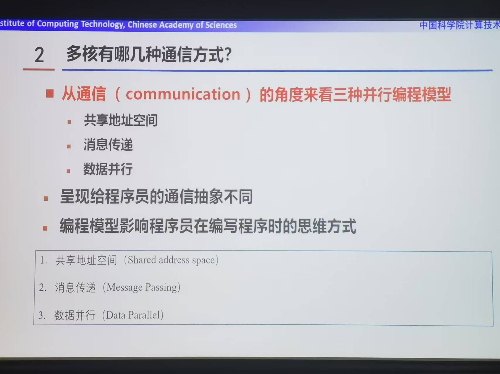
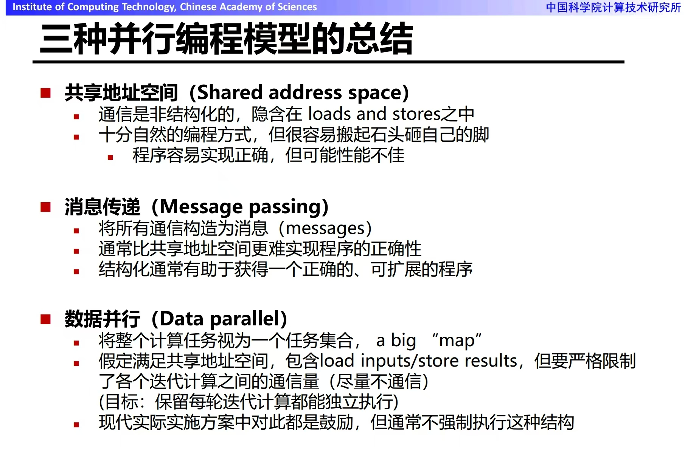

b# 并行处理

## 题型
- 全是简答题，言之有理即可
- 存储一致性几个协议看一下

## 题目列表
1. 从上层应用出发的并行程序的两种通用模型是什么？请列出并分别解释这两种模型。
2. 列出现代处理器并行执行的主要形式，并分别解释。
3. 分析多线程的收益和代价，并举例吞吐导向的多线程代表架构。
4. Flynn 分类法是如何对并行分类的？
5. 多核有哪几种通信方式？
6. 列举减少访存延迟和隐藏访存延迟的方法。
7. SMP 和 NUMA 架构分别是什么，各自有什么优缺点。
8. 并行编程模型分别是哪三种，并分别阐述三种模型各自的特点。
9. 请举一个常用的混合编程模型的例子？其好处是什么？
10. 基于共享地址空间的通用同步原语有哪些？具体进行解释。
11. 在讨论局部性时会从哪两个维度上进行讨论，两种局部性分别指的是什么，cache 利用了哪种局部性原理？
12. 导致 cache miss 的原因是什么？并分析如何避免/减少每种 cache miss？
13. 请列举出降低通信开销的几种方法？
14. 并行编程中，造成竞争的原因有哪些，如何减小竞争？
15. 介绍为了使工作负载更均衡，在任务调度时可以采取的机制，以及可能的困难。
16. 导致应用可扩展性差的因素有哪些？并从中选出两个因素分析如何发现这种因素以及如何解决？
17. 请解释强可扩展性和弱可扩展性。
18. 导致并行计算无法达到理想加速比的并行性能开销有哪些？
19. 请画出 VGG 和 MobileNet 两个神经网络模型推理对应的 roofline 模型，并标出 VGG 和 MobileNet 在图中的位置。
20. 请结合 roofline 模型，在下述配置的处理器中优化 Stencil 程序。
21. 请简述并行程序 Benchmark 的选取原则是什么。
22. SIMD 和 SIMT 架构分别是什么，请分别解释。
23. 简述线程分组的两种方式，并分析动态线程分组的缺点。
24. 介绍一下 CUDA 编程中，并发线程的层次结构，以及 CUDA 对并行提供的支撑。
25. 请列举至少三种提高 CUDA 代码效率的方法。
26. 列举四种常见的共享存储多处理器架构，并分别解释。
27. 解释存储一致性模型、顺序一致性模型。
28. 在顺序同一性下，(A,B)的可能结果包括哪几种？并举例说明对应的实际执行顺序（每种结果举 1 个例子即可）。不可能的结果是什么？如果实际执行的顺序是 1b->1a->2b->2a，满足顺序同一性吗？解释原因。
29. 举例几种常见的互联拓扑结构，并给出其网络直径和和对分带宽分析。
30. 论述互连网络中，死锁出现的原因和避免的方法，给出一种避免方法的示例。
31. 片上网络的流控按粒度划分可以分为哪几类，并分别介绍一种对应的流控技术
32. 分析 N 维、每维上有 k 个节点的 Torus 片上互连拓扑结构的对分带宽、饱和吞吐、网络直径和平均跳步。
33. 列举常用的利用空间局部性的方法。
34. 列举事务性内存的优势。
</br>

*****

## 题目解答

### 1. 从上层应用出发的并行程序的两种通用模型是什么？请列出并分别解释这两种模型。

从上层应用出发的并行程序有两种通用模型：数据并行模型和任务并行模型。

1. **数据并行模型**
   - **解释**：在数据并行模型中，重点是对数据进行划分，多个处理器同时对不同的数据部分执行相同的操作。例如，在一个图像处理程序中，要对一幅高分辨率的图像进行滤波处理。可以将图像分割成多个子区域（比如按照行或者列划分），每个处理器负责处理一个子区域。所有处理器执行的滤波算法是完全相同的，只是处理的数据不同。这种并行方式可以显著提高处理大规模数据的速度，因为它充分利用了多个处理器的计算能力来同时处理数据的不同部分。数据并行模型的核心在于数据的划分策略和在不同处理器上的同步机制。在实际应用中，需要考虑如何划分数据才能使负载平衡，也就是让每个处理器的工作量大致相同，避免有的处理器闲置，有的处理器负担过重的情况。同时，在处理过程中可能需要在合适的时间点进行同步，例如在完成一个阶段的计算后，需要将各个处理器处理的结果进行汇总或者合并，这就要求有良好的通信和同步机制。
2. **任务并行模型**
   - **解释**：任务并行模型强调的是将一个大的任务分解为多个相对独立的子任务，这些子任务可以在不同的处理器上同时执行。以一个复杂的三维游戏渲染为例，渲染场景包括地形渲染、角色渲染、光影效果渲染等多个任务。这些任务之间有一定的独立性，可以分配给不同的处理器同时进行。每个处理器负责一个特定的任务，并且这些任务之间可能存在一定的依赖关系和通信需求。例如，角色的光影效果可能依赖于地形的光照信息。任务并行模型的关键在于任务的分解和任务之间的协调。要合理地将一个大任务分解成可以并行执行的子任务，需要对应用程序的功能和流程有深入的理解。同时，要处理好子任务之间的依赖关系，确保在需要某个子任务的结果来进行后续任务时，这个结果能够及时、正确地传递和使用，这涉及到处理器之间的通信和同步机制，以及任务调度策略。
</br>

*****

### 2. 列出现代处理器并行执行的主要形式，并分别解释。
现代处理器并行执行的主要形式有以下几种：

#### 指令级并行
- **流水线技术**：将指令执行过程划分为多个阶段，如取指令（IF）、译码（ID）、执行操作（EX）、访问内存（MEM）和回写结果（WB）等。不同指令在不同阶段可以并行处理，当一条指令在某个阶段处理时，下一条指令可以进入前一阶段，使得多个指令在同一时间处于不同的执行阶段，从而提高处理器的吞吐率。例如，经典的五级流水线可以让指令像流水线上的产品一样，在每个时钟周期都有新的指令进入流水线并在不同阶段并行执行。
- **超标量架构**：允许处理器在同一时钟周期内发射多条指令，这些指令可以同时在不同的执行单元中执行。处理器会自动检查指令间的依赖性，在操作数可用时发射指令，并通过复杂的硬件逻辑来动态管理指令间的依赖和并行性，以充分利用处理器的资源，提高整体性能和吞吐量。例如，一个双发射超标量处理器可以在每个时钟周期发射两条指令。
- **乱序执行**：处理器根据资源可用性和数据依赖关系，重新排列指令的执行顺序，不按照程序中指令的原始顺序执行。它可以先执行不依赖前序结果的指令，从而减少指令等待时间，提高并行度，但需要复杂的硬件支持来跟踪指令的依赖关系和执行状态，以确保程序的正确性。

#### 数据级并行
- **单指令多数据流（SIMD）**：同一操作会重复处理多个数据，一条指令可以在不同的数据组上完成相同的操作，由一个指令流控制多个处理单元同时对不同的数据进行相同的运算。例如，在图像处理中，对图像的每个像素进行相同的颜色调整或滤波操作，就可以使用SIMD指令，让多个处理单元同时处理不同的像素，大大提高处理效率。SIMD技术在多媒体处理、科学计算等领域应用广泛，常见的有Intel的SSE、AVX指令集等。
- **向量处理**：将数据组织成向量形式，处理器可以对整个向量进行并行操作，一条向量指令可以同时处理多个数据元素，而不是单个数据。向量处理单元通常具有专门的硬件来实现高效的向量运算，如向量加法、乘法等。在高性能计算中，如天气预报、地震模拟等需要对大量数据进行重复计算的场景，向量处理可以显著提高计算速度。

#### 线程级并行
- **对称多处理机（SMP）**：多个相同或相似的处理器通过总线形式或开关阵列互连，共享单一存储器或存储器组，所有处理器都可以平等地访问内存和其他资源，共同处理一个任务或多个任务。操作系统会将任务分配到不同的处理器上并行执行，通过并行处理提高系统的整体性能。在这种系统中，处理器之间的通信开销相对较小，但随着处理器数量的增加，可能会出现总线竞争等问题。
- **大规模并行处理机（MPP）**：由大量相对独立的处理节点组成，每个节点都有自己的处理器、内存和I/O设备，节点之间通过高速网络互连。MPP系统通常用于处理大规模的并行计算任务，如大规模数据挖掘、生物信息学分析等，各个节点可以并行地处理不同的数据子集或任务，通过消息传递机制进行通信和协作。
- **机群系统**：由一组完整的计算机通过通信链路或网络设备互连形成，作为统一的计算资源一起进行数据处理，整个机群外部可以看作是一台大型计算机。机群系统中的计算机可以是同构的，也可以是异构的，适用于大规模的分布式计算和高性能计算任务，通过并行计算和任务调度提高系统的处理能力。

#### 其他并行形式
- **位级并行**：基于处理器的字长不断增加，在字长范围内可以同时处理多个位的操作，例如在进行位运算时，可以同时对多个位进行逻辑运算或移位操作，提高运算速度。
- **多功能部件并行**：一台处理机具有多个功能部件，如浮点加、定点加、浮点乘、浮点除、逻辑操作、移位等功能部件，各功能部件可以并行地处理数据，因而处理机可以使用不同的功能部件并行执行几条指令，以提高处理速度。
</br>


以下是对这三种现代处理器并行执行主要形式的更详细介绍：

#### 超标量
- **基本原理**：超标量处理器在每个时钟周期可以发射多条指令到不同的执行单元，这些指令来自于同一指令流。例如，传统处理器可能在一个时钟周期只能执行一条指令，而超标量处理器可能在一个时钟周期内同时执行两条、三条甚至更多指令。
- **指令并行发现机制**：处理器内部的硬件逻辑会动态地检测指令之间的依赖关系和资源可用性。比如，一条加法指令和一条乘法指令，如果它们所使用的操作数没有依赖关系（即一个指令的结果不会作为另一个指令的输入），并且执行单元有空闲，那么硬件就可以同时发射这两条指令到相应的加法器和乘法器执行单元进行并行处理。这种动态检测和调度是在指令执行的过程中实时进行的，无需程序员手动干预或提前知道指令的并行性。
- **对性能的影响**：通过提高指令的并行执行程度，超标量技术可以显著提升处理器的指令吞吐率，从而加快程序的执行速度。例如，在处理一些包含大量独立指令的程序时，如科学计算中的矩阵运算，超标量处理器可以更高效地利用硬件资源，减少指令执行的总时间。

#### 多核
- **核心概念**：多核处理器是在一个芯片上集成了多个独立的处理核心，每个核心都类似于一个单独的处理器，具有自己的寄存器、运算单元、缓存等。例如，常见的双核处理器就有两个处理核心，四核处理器则有四个。
- **线程级并行性实现**：每个核心可以独立地执行一个线程（线程是程序执行的一个独立路径）。软件可以根据任务的特点，将任务划分为多个线程，然后分配到不同的核心上同时执行。例如，在一个视频编辑软件中，可以将视频的编码任务分配到一个核心，将音频的处理任务分配到另一个核心，两个核心同时工作，大大提高了整体处理效率。
- **线程创建与管理**：软件通过特定的API（如pthreads API）来创建和管理线程。程序员需要根据程序的逻辑和数据依赖关系，合理地设计线程的创建、同步和通信机制。例如，在多线程编程中，可能需要使用互斥锁、信号量等机制来确保多个线程对共享资源的正确访问，避免出现数据竞争等问题。
- **性能优势与挑战**：多核处理器可以充分利用线程级并行性，对于多任务处理和并行计算密集型的应用（如服务器应用、大型游戏等），可以显著提高系统的吞吐量和响应速度。然而，要充分发挥多核的优势，需要软件能够有效地进行并行编程，这对程序员提出了更高的要求，同时也需要操作系统能够更好地进行任务调度和资源管理。

#### SIMD
- **原理与架构**：SIMD架构中，一条指令可以同时对多个数据元素进行相同的操作。例如，一个具有4个ALU的SIMD单元，当执行一条加法指令时，可以同时对4个不同的数据进行加法运算。这些数据通常存储在连续的内存区域中，并且具有相同的数据类型和操作类型。
- **向量化实现方式**：
    - **编译器显式SIMD**：程序员可以通过特定的编译器指令或编程语言扩展（如C++中的SIMD intrinsics）显式地告诉编译器哪些代码段可以进行向量化。例如，在处理图像数据时，程序员可以使用显式SIMD指令来同时对多个像素的颜色值进行相同的调整操作，如增加亮度或对比度。编译器会根据这些指令生成相应的SIMD指令代码，利用处理器的SIMD功能进行高效处理。
    - **硬件自动向量化**：一些高级编译器可以通过对程序代码的循环分析，自动检测出可以进行向量化的代码段，并生成相应的SIMD指令。例如，对于一个简单的循环，对数组中的每个元素进行相同的运算，编译器可以分析出该循环可以进行向量化，并在运行时利用处理器的SIMD功能来并行处理数组元素，而无需程序员手动干预。
- **依赖性处理**：在SIMD操作中，数据之间的依赖性需要在执行前明确。如果数据之间存在依赖关系，可能会导致错误的结果。例如，在一个对数组元素进行累加的操作中，如果不考虑元素之间的依赖关系，直接使用SIMD进行并行处理，可能会得到错误的累加结果。通常，程序员需要声明数据的依赖性，或者编译器通过高级的循环分析技术来推断数据的依赖性，以确保SIMD操作的正确性。
- **应用场景**：SIMD技术在多媒体处理（如图像处理、音频处理）、科学计算（如矩阵运算、向量运算）、3D图形渲染等领域有广泛的应用。这些领域通常涉及对大量数据进行相同或相似的操作，SIMD可以大大提高数据处理的效率，减少计算时间。例如，在图像处理中，对图像的每个像素进行滤波操作，使用SIMD可以同时处理多个像素，显著提高图像处理的速度。

这三种并行执行形式相互补充，可以根据不同的应用场景和需求进行组合使用，以最大程度地提高现代处理器的性能和效率。例如，在一个复杂的多媒体处理应用中，可能同时利用多核处理器的多个核心来处理不同的任务（如视频解码、音频处理等），每个核心内部又可以利用超标量技术和SIMD技术来进一步提高指令和数据的处理速度。
</br>

### 3. 分析多线程的收益和代价，并举例吞吐导向的多线程代表架构。


以下是关于多线程的收益和代价的分析，以及吞吐导向的多线程代表架构举例：

#### 一、多线程的收益
1. **提高处理器利用率**
    - **原理**：当一个线程因等待 I/O 操作（如磁盘读写、网络请求）或其他资源而阻塞时，其他线程可以继续在处理器上执行，避免处理器处于空闲状态，从而充分利用处理器的计算资源。
    - **举例**：在一个网络服务器应用中，一个线程可能在等待从网络接收数据，此时另一个线程可以处理已经接收到的数据并发送响应，这样处理器始终有工作可做，提高了整体的资源利用率。
2. **增强系统吞吐率**
    - **原理**：多个线程可以同时处理不同的任务或数据，使得单位时间内系统能够完成更多的工作，从而提高系统的吞吐率。
    - **举例**：在数据库服务器中，多个线程可以并行处理不同客户端的查询请求，加快查询处理速度，提高服务器在单位时间内能够处理的查询数量，即提高了系统的吞吐率。
3. **更好地响应多任务环境**
    - **原理**：在现代操作系统中，通常会同时运行多个应用程序或任务，多线程可以使应用程序在这种多任务环境中更高效地运行，及时响应用户的操作和系统的事件。
    - **举例**：在一个图形用户界面（GUI）应用中，一个线程可以负责处理用户界面的交互（如鼠标点击、键盘输入等），另一个线程可以在后台进行数据处理或网络通信，这样用户在操作界面时不会感觉到明显的卡顿，提高了用户体验。

#### 二、多线程的代价
1. **线程创建与管理开销**
    - **原理**：创建线程需要分配线程控制块、栈空间等资源，线程切换时需要保存和恢复线程的上下文（包括寄存器状态、程序计数器等），这些操作都需要消耗一定的时间和系统资源。
    - **举例**：如果一个程序频繁地创建和销毁线程，例如在一个简单的循环中每次迭代都创建一个新线程来处理少量数据，那么线程创建和销毁的开销可能会超过多线程带来的性能提升，导致程序性能下降。
2. **同步与互斥开销**
    - **原理**：当多个线程访问共享资源（如全局变量、共享内存区域等）时，需要使用同步机制（如互斥锁、信号量等）来确保数据的一致性和正确性。这些同步操作会引入额外的开销，包括获取和释放锁的时间、线程阻塞和唤醒的开销等。
    - **举例**：在一个多线程的银行账户管理系统中，如果多个线程同时对一个账户进行取款操作，为了保证账户余额的正确性，需要使用互斥锁来保护对账户余额的访问。当一个线程获取锁进行取款操作时，其他线程需要等待锁的释放，这可能会导致线程阻塞，增加了程序的执行时间。
3. **复杂性增加**
    - **原理**：多线程编程需要考虑线程之间的同步、通信、数据共享等问题，这使得程序的逻辑变得更加复杂，容易出现死锁、竞态条件等问题，增加了程序的开发和调试难度。
    - **举例**：在一个多线程的生产者 - 消费者模型中，如果生产者和消费者线程之间的同步机制设计不合理，可能会出现生产者生产速度过快，导致缓冲区溢出，或者消费者消费速度过快，导致缓冲区为空而消费者一直等待的情况，这些问题都需要程序员仔细设计和调试才能解决。

#### 三、吞吐导向的多线程代表架构 - 同时多线程（SMT）架构
- **架构特点**：同时多线程技术允许在一个物理处理器核心上同时执行多个线程（通常是两个或多个），这些线程共享处理器的执行资源，如执行单元、缓存等。处理器可以在每个时钟周期从多个线程中选择指令进行发射和执行，从而提高处理器的指令级并行度和吞吐率。
- **工作原理**：例如，在一个双线程的SMT处理器中，当一个线程因等待数据而暂停时，处理器可以切换到另一个线程继续执行指令，充分利用处理器的空闲资源。同时，硬件会动态地管理线程之间的资源分配和指令调度，以最大化处理器的利用率和吞吐率。
- **应用场景**：在服务器和高性能计算领域应用广泛，因为这些场景对系统的吞吐率要求较高。例如，在大型数据中心的服务器中，运行着多个虚拟机或应用程序，SMT架构可以更好地处理这些并发任务，提高服务器的整体性能和资源利用率，从而能够服务更多的用户请求或处理更大规模的数据。

#### 四、吞吐导向的多线程代表架构 - GPGPU 架构
GPGPU（General-purpose computing on graphics processing units）即通用并行图形处理器，是一种吞吐导向的多线程代表架构，以下是对其的介绍：

##### 架构特点
- **大规模并行核心**：拥有数千个甚至更多的核心，如NVIDIA的一些高端GPGPU芯片拥有数千个CUDA核心，这些核心可以同时处理不同的任务或数据，提供了高度的并行性。
- **多线程执行模型**：采用单指令多线程（SIMT）执行模型，多个线程以锁步方式执行同一条指令，但处理不同的数据。例如，在一个线程束（warp）中通常包含32个线程，这些线程会同时执行相同的指令，但操作的数据不同。
- **多层存储架构**：通常具有多层存储结构，包括寄存器、共享内存、缓存和全局内存等。不同层次的存储具有不同的访问速度和容量，以满足不同的计算需求。例如，共享内存的访问速度较快，可用于线程之间的数据共享和通信，而全局内存的容量较大，但访问速度相对较慢。

##### 工作原理
- **指令执行流程**：多个线程束按照流水方式执行指令的读取、解码、发射、执行及写回过程。线程束调度器会选择就绪的线程束指令进行发射执行，从寄存器文件中读取源寄存器传送给执行单元。
- **延迟隐藏机制**：通过硬件多线程技术，提供数以千计的并行独立线程，当一个线程等待数据和纹理加载等长延迟操作时，硬件可以执行其他线程，从而利用其他线程的计算掩盖存储访问延时，提升整体的计算吞吐率。例如，一个warp的一条指令需要等待先前启动的长延迟操作的结果时，系统会调度另一个不必等待的常驻warp继续执行。

##### 应用场景
- **深度学习**：在神经网络的训练和推理过程中，需要处理大量的矩阵运算和数据并行任务，GPGPU的大规模并行计算能力可以显著加速这一过程。例如，图像识别、语音识别、自然语言处理等领域的深度学习模型训练，使用GPGPU可以将训练时间从数月缩短到数天甚至数小时。
- **科学计算**：在物理、化学、生物等科学领域，经常需要进行大规模的数值模拟和计算，如分子动力学模拟、气候模拟、天体物理模拟等。GPGPU可以并行处理大量的数据和计算任务，提高计算效率，加速科学研究的进程。
- **图形渲染**：虽然GPGPU的主要应用已经扩展到通用计算领域，但它仍然是图形渲染的核心处理器。在游戏开发、动画制作、虚拟现实等领域，GPGPU可以快速处理图形数据，生成高质量的图像和动画。


多线程技术在带来性能提升的同时，也伴随着一定的代价和复杂性。在实际应用中，需要根据具体的应用场景和需求，权衡多线程的收益和代价，合理地设计和使用多线程程序，以充分发挥多线程的优势，同时避免其带来的问题。同时多线程架构是吞吐导向的多线程的典型代表，通过在硬件层面支持多线程的同时执行，进一步提高了处理器的性能和效率。
</br>

****

### 4. Flynn 分类法是如何对并行分类的？

Flynn分类法是根据指令流和数据流的多倍性特征对计算机系统进行分类，具体如下：

#### 一、指令流（Instruction Stream，IS）和数据流（Data Stream，DS）的概念
- **指令流**：计算机执行的指令序列，即程序中指令的执行顺序和流程。
- **数据流**：指令执行过程中所处理的数据序列，包括数据的来源、流向和处理方式。

#### 二、分类方式及具体类别
1. **单指令流单数据流（SISD）**
    - **特点**：一个处理器在一个时钟周期内执行一条指令，处理一个数据。这是传统的冯·诺依曼计算机体系结构，大多数早期的计算机都属于这一类。
    - **示例**：早期的个人计算机，如8086处理器的计算机，在某一时刻只能执行一条指令，处理一个数据。
2. **单指令流多数据流（SIMD）**
    - **特点**：一条指令可以同时对多个数据进行相同的操作。它利用数据级并行性，通过一个指令流控制多个处理单元同时对不同的数据进行相同的运算。
    - **示例**：现代图形处理器（GPU）在进行图像处理时，一条指令可以同时对多个像素进行相同的颜色调整或滤波操作；多媒体扩展指令集（如Intel的SSE、AVX指令集）也属于SIMD，可同时处理多个数据元素，提高多媒体处理等应用的性能。
3. **多指令流单数据流（MISD）**
    - **特点**：多个指令流处理同一个数据流。这种架构在实际中很少见，因为它在实现和应用上存在诸多困难，且实际效益不高。
    - **示例**：目前几乎没有实际广泛应用的MISD计算机系统，更多是一种理论上的分类。
4. **多指令流多数据流（MIMD）**
    - **特点**：多个处理器或处理单元可以同时执行不同的指令流，处理不同的数据流，具有高度的并行性和灵活性，可以实现任务级并行和数据级并行。
    - **示例**：对称多处理机（SMP）系统，多个处理器共享内存和其他资源，可同时执行不同的任务；大规模并行处理机（MPP）系统，由大量相对独立的处理节点组成，每个节点都有自己的处理器、内存和I/O设备，节点之间通过高速网络互连，可并行处理大规模的计算任务；机群系统，由一组完整的计算机通过通信链路或网络设备互连形成，作为统一的计算资源一起进行数据处理，适用于大规模分布式计算和高性能计算任务。

Flynn分类法为理解和分析计算机系统的并行性提供了一个基本框架，有助于根据不同的应用需求选择合适的计算机架构和并行处理技术。
</br>

*****

### 5. 多核有哪几种通信方式？

在多核处理器环境下，主要有以下几种通信方式：

#### 一、共享内存通信
1. **基本原理**
    - 多核处理器共享同一块物理内存空间，各个核心可以通过访问共享内存区域来实现数据的交换和通信。每个核心都可以读写这块共享内存，就像多个线程访问共享变量一样，但需要注意数据的一致性和同步问题。
2. **同步机制**
    - **互斥锁（Mutex）**：当多个核心需要访问共享内存中的同一数据结构（如一个数组或链表）时，使用互斥锁来保证在同一时刻只有一个核心能够对其进行修改。例如，一个核心在访问共享内存中的某个链表并进行插入操作时，会先获取互斥锁，操作完成后再释放锁，这样其他核心在该核心持有锁期间无法访问这个链表，从而避免数据不一致。
    - **信号量（Semaphore）**：信号量是一种更灵活的同步工具，可以用于控制对共享资源的访问数量。例如，在一个生产者 - 消费者模型中，使用信号量来控制缓冲区的空闲位置数量和已占用位置数量。生产者在往缓冲区放入数据前，先检查表示空闲位置数量的信号量，如果有空闲位置（信号量的值大于0），则可以放入数据并减少信号量的值；消费者在从缓冲区取出数据前，先检查表示已占用位置数量的信号量，有数据可取时（信号量的值大于0），则可以取出数据并增加空闲位置信号量的值。
    - **读写锁（Read - Write Lock）**：对于共享内存中一些数据结构，如果读操作可以同时进行，而写操作需要互斥进行，就可以使用读写锁。例如，一个全局的配置数据结构，多个核心可能经常需要读取其中的配置信息，但很少需要修改。使用读写锁时，多个核心可以同时获取读锁进行读取操作，但当一个核心要进行写操作时，必须先获取写锁，此时其他核心的读操作和写操作都需要等待，直到写操作完成并释放写锁。
3. **缓存一致性问题及解决方法**
    - **问题产生原因**：每个核心都有自己的缓存（Cache），当一个核心修改了共享内存中的数据并将其存储在自己的缓存中时，其他核心的缓存中的数据可能就过时了。例如，核心A修改了共享内存中的一个变量的值，这个新值存储在核心A的缓存中，但核心B的缓存中仍然是旧值，这就导致了数据不一致。
    - **解决方法 - 缓存一致性协议**：常用的有MESI协议（Modified、Exclusive、Shared、Invalid）及其变种。以MESI为例，当一个核心修改了共享内存中的数据，该数据在这个核心的缓存中的状态变为“Modified”，其他核心缓存中相同数据的状态会变为“Invalid”。当其他核心需要访问这个数据时，会发现自己缓存中的数据是无效的，就会从主存或者状态为“Modified”的缓存中获取最新的数据，从而保证数据的一致性。

#### 二、消息传递通信
1. **基本原理**
    - 各个核心之间通过发送和接收消息来进行通信，就像不同的计算机通过网络进行通信一样。每个核心都有自己独立的本地内存，数据不直接共享，而是通过消息的形式在核心之间传递。这种通信方式类似于分布式系统中的节点间通信。
2. **实现方式**
    - **硬件消息传递机制**：有些多核处理器提供了专门的硬件消息传递通道，如片上网络（Network - on - Chip，NoC）。NoC是一种在芯片内部实现的通信网络，各个核心通过这个网络发送和接收消息。例如，在一个具有NoC的多核处理器中，核心A要给核心B发送一条消息，会将消息封装并通过NoC中的路由节点发送到核心B，核心B接收到消息后进行解析处理。
    - **软件消息传递库**：在没有专门硬件支持的情况下，可以使用软件消息传递库来实现通信。例如，Message Passing Interface（MPI）是一种广泛使用的消息传递标准库，它提供了一组用于发送和接收消息的函数接口，如MPI_Send和MPI_Recv。程序员可以使用这些函数在不同的核心之间编写消息传递程序，实现数据交换和任务协调。

#### 三、数据并行
数据并行是指将数据集划分为多个子集，并在不同的处理器上并行处理这些子集。以下是一些常见的数据并行方法：

##### 基于数据划分的数据并行
- **块状划分**：将数据划分为固定大小的块，每个块由一个处理核负责计算。例如在处理大型矩阵乘法时，可将矩阵按行或列划分为多个子矩阵块，每个处理核负责计算一个子矩阵块的乘法结果，最后再将这些结果合并。这种方法适用于数据结构规整、数据之间独立性较强的情况，如大规模图像数据的处理，可将图像划分为多个小块分别处理。
- **循环划分**：将数据划分为循环，每个循环由一个处理核负责计算。通常用于循环迭代计算的场景，如对一个大型数组进行循环遍历求和，可将循环迭代次数平均分配给各个处理核，每个核负责一部分循环的计算。这种方法实现相对简单，但可能需要注意循环之间的依赖关系和数据同步问题。
- **树状划分**：将数据划分为树形结构，每个子树由一个处理核负责计算。适用于具有层次结构的数据，如在处理文件系统目录结构或树形数据结构时，可将树的不同子树分配给不同的处理核进行处理，各核可独立地对其负责的子树进行遍历、搜索或其他操作。

##### 基于模型并行的数据并行
- **神经网络模型并行**：在深度学习中，对于非常大的神经网络模型，由于单个处理单元的内存和计算能力有限，无法处理整个模型。可以将模型的不同层或不同部分分配到不同的处理核或设备上进行并行计算。例如，将卷积神经网络的卷积层、池化层、全连接层等分别分配到不同的GPU上进行计算，在训练过程中，各层之间通过消息传递或共享内存等方式进行数据交互和同步。
- **分布式模型并行**：当处理大规模的机器学习或数据挖掘任务时，数据量和模型复杂度都非常高，可采用分布式模型并行方法。将模型和数据分布在多个计算节点上，每个节点负责模型的一部分和相应的数据子集。节点之间通过网络进行通信和协作，共同完成模型的训练和优化。如在大规模的图像识别或自然语言处理任务中，可将数据和模型分布在多个服务器上进行并行训练。

##### 基于任务调度的数据并行
- **静态调度**：在任务分配之前，对任务进行分析，根据任务的特性和核心的性能，将任务分配到最适合的核心中。这种方法可以有效地减少任务之间的竞争，提高并行算法的性能，但任务分配不够灵活，当任务的特性发生变化时，需要重新分配任务。
- **动态调度**：在任务运行过程中，根据任务的运行情况和核心的负载情况，动态地调整任务的分配。可以有效地提高任务的吞吐量，降低任务的平均等待时间，但任务分配开销大，可能会导致任务之间的竞争。
</br>

****

### 6. 列举减少访存延迟和隐藏访存延迟的方法。

以下是一些减少访存延迟和隐藏访存延迟的方法：

#### 减少访存延迟的方法
- **优化数据存储布局**：
    - **提高数据局部性**：根据程序的数据访问模式，将经常一起访问的数据放在相邻的内存位置，以提高缓存命中率，减少访存延迟。例如在矩阵运算中，按照矩阵块的方式存储数据，使得在进行计算时，同一小块矩阵的数据能够被连续访问。
    - **数据对齐**：确保数据按照处理器所要求的对齐方式存储，这样可以使内存访问更加高效，减少因数据未对齐而导致的额外访存开销。
- **利用高速缓存**：
    - **合理使用各级缓存**：充分利用处理器的多级缓存结构，将常用的数据提前加载到缓存中。例如，在循环中频繁访问的数组元素，可以在循环开始前将其加载到缓存中，减少对主存的访问。
    - **缓存预取**：通过硬件或软件的方式，提前预测程序即将访问的数据，并将其预取到缓存中。一些处理器提供了预取指令，开发者可以在代码中显式地使用这些指令来预取数据。
- **优化内存访问模式**：
    - **顺序访问**：在访问内存时，尽量按照顺序访问数据，避免随机访问。因为顺序访问可以更好地利用内存的预取机制和缓存的局部性原理，减少访存延迟。例如，在遍历数组时，按照顺序依次访问数组元素，而不是随机跳跃访问。
    - **内存合并**：在多线程或并行计算环境中，将多个小的内存访问请求合并为一个大的请求，以减少内存访问的次数和延迟。例如，在GPU编程中，通过合理组织线程的内存访问，使得多个线程能够同时访问相邻的内存地址，从而实现内存合并。

#### 隐藏访存延迟的方法
- **多线程与并行计算**：
    - **多线程编程**：通过在处理器上同时运行多个线程，当一个线程因访存延迟而等待数据时，其他线程可以继续执行，从而利用线程之间的并行性来隐藏访存延迟。例如，在服务器程序中，使用多线程来处理多个客户端的请求，当一个线程在等待数据库查询结果时，其他线程可以处理其他客户端的请求。
    - **数据并行与任务并行**：将数据或任务划分为多个部分，在不同的处理单元上并行处理，这样可以使访存操作与计算操作重叠进行，隐藏访存延迟。例如，在深度学习中，使用多个GPU对不同批次的数据进行并行训练。
- **预取技术**：提前获取可能需要的数据到缓存或寄存器中，使得在真正需要访问该数据时，数据已经在高速存储部件中，从而隐藏了访存延迟。除了上述提到的显式预取指令外，一些硬件会自动根据程序的访问模式进行预取，如CPU的硬件预取机制。
- **异步操作**：将访存操作设置为异步进行，即程序在发起访存请求后，不需要等待数据返回就可以继续执行其他操作，当数据返回时再进行相应的处理。例如，在网络编程中，使用异步I/O操作，当发送或接收数据时，程序可以继续执行其他任务，而不需要等待网络传输完成。
- **流水线技术**：将访存操作和其他计算操作按照流水线的方式组织，使得不同的操作可以在不同的阶段同时进行。例如，在CPU的指令流水线中，指令的取指、译码、执行等阶段可以重叠进行，当一条指令在执行阶段因访存延迟而等待数据时，其他指令可以在取指和译码阶段继续进行，从而提高整体性能。
</br>

*****

### 7. SMP 和 NUMA 架构分别是什么，各自有什么优缺点。

1. **SMP（对称多处理）架构**
    - **定义**：
        - SMP架构是一种多处理器计算机体系结构，在这种架构中，多个相同或相似的处理器通过总线或开关阵列互连，共享单一的主存储器以及I/O设备等其他资源。所有处理器都可以平等地访问内存和其他资源，并且操作系统将任务或线程分配到不同的处理器上进行并行处理。
    - **优点**：
        - **编程简单**：对于程序员来说，编写并行程序相对容易。因为系统对所有处理器呈现出统一的内存视图，就像在单处理器系统上编程一样，只是可以利用多个处理器来同时执行多个线程或任务。例如，在开发多线程应用程序时，程序员不需要特别关注数据存储位置与处理器的关系，使用标准的多线程编程模型（如pthreads）即可。
        - **负载均衡容易实现**：操作系统可以很方便地将任务均匀分配到各个处理器上。由于所有处理器共享内存和资源，调度器可以根据处理器的负载情况动态地分配任务，从而实现较好的负载均衡。例如，在一个多任务处理的服务器环境中，当有多个客户端请求到来时，操作系统可以将这些请求对应的任务均匀地分配到各个处理器上进行处理。
        - **数据共享方便**：多个处理器可以直接访问共享内存中的数据，这对于需要频繁共享数据的应用程序非常有利。例如，在一个数据库管理系统中，多个处理器可能需要同时访问和修改数据库中的数据，在SMP架构下，这种数据共享可以通过简单地访问共享内存来实现。
    - **缺点**：
        - **扩展性受限**：随着处理器数量的增加，共享总线或共享资源（如内存）可能会成为性能瓶颈。因为所有处理器都通过同一总线访问内存，当处理器数量增多时，总线争用会加剧，导致访存延迟增加。例如，在一个具有大量处理器的SMP系统中，多个处理器同时请求访问内存时，会出现排队等待的情况，降低了系统的整体性能。
        - **内存带宽问题**：由于所有处理器共享内存带宽，在高负载情况下，内存带宽可能不足以满足所有处理器的需求。特别是对于内存密集型应用，如大型数据处理或科学计算应用，可能会出现内存带宽瓶颈，影响系统性能。
        - **可靠性相对较低**：因为所有处理器和资源紧密耦合，一旦共享资源（如内存模块或总线）出现故障，整个系统可能会受到影响。相比其他具有冗余设计的架构，SMP架构在单点故障方面的容错能力较弱。

2. **NUMA（非一致内存访问）架构**
    - **定义**：
        - NUMA架构也是一种多处理器体系结构，它由多个节点组成，每个节点包含一个或多个处理器、本地内存和I/O设备。各个节点之间通过高速互连网络（如高速缓存一致性协议支持的网络）相连。与SMP不同的是，每个处理器访问本地节点的内存速度比访问其他节点的内存速度快，即内存访问时间是非一致的。
    - **优点**：
        - **扩展性较好**：相比SMP架构，NUMA架构可以更好地支持大量处理器的扩展。因为它的分布式内存结构和节点间的高速互连网络可以缓解因处理器增多而带来的共享资源瓶颈问题。例如，在大型数据中心服务器中，采用NUMA架构可以有效地扩展处理器数量，以应对不断增长的计算需求。
        - **内存带宽利用率高**：每个节点有自己的本地内存，这使得内存带宽可以在各个节点内得到有效利用，减少了因共享内存带宽而导致的竞争。对于内存密集型应用，每个节点的处理器可以更高效地访问本地内存，提高了系统的整体内存访问效率。
        - **部分故障不影响全局**：由于具有分布式的节点结构，一个节点出现故障时，其他节点仍可以继续工作，系统的容错能力相对较强。例如，在一个包含多个NUMA节点的服务器中，如果一个节点的处理器或内存出现故障，其他节点可以继续处理任务，只是系统的整体性能会有所下降。
    - **缺点**：
        - **编程复杂**：由于内存访问的非一致性，程序员在编写程序时需要考虑数据存储位置与处理器的关系，以优化内存访问效率。例如，需要尽量将数据分配到处理器对应的本地节点内存中，并且要注意跨节点内存访问可能带来的性能下降。这增加了程序开发的难度和复杂性。
        - **负载均衡难度增加**：操作系统在进行任务分配和负载均衡时，需要考虑节点之间的差异和内存访问成本。要实现高效的负载均衡，不仅要考虑处理器的负载，还要考虑内存的使用情况和节点间的通信成本，这使得负载均衡策略变得更加复杂。
        - **数据一致性维护复杂**：在NUMA架构中，虽然有高速互连网络和缓存一致性协议来维护数据一致性，但相比SMP架构，其数据一致性的维护更加复杂。因为不同节点的处理器对内存的访问时间不同，可能会导致缓存一致性问题更加复杂，需要更复杂的协议和机制来确保数据在各个节点之间的一致性。
</br>

### 8. 并行编程模型分别是哪三种，并分别阐述三种模型各自的特点。


并行编程模型主要有共享内存模型、消息传递模型和数据并行模型，以下是它们各自的特点：

#### 共享内存模型
- **特点**：
    - **内存共享**：多个线程或进程可以直接访问同一块共享内存区域。这种共享方式使得数据的交换和共享变得非常方便，线程或进程之间可以通过读写共享变量来进行通信。例如，在一个多线程的服务器程序中，所有线程可以访问和修改共享的数据库连接池，通过对连接池中的连接对象进行操作来处理客户端请求。
    - **隐式通信**：通信是通过共享内存中的数据来实现的，不需要显式地发送和接收消息。这使得编程相对简单，程序员可以像编写单线程程序一样操作共享数据，重点关注数据的读写顺序和同步问题。例如，在一个多线程的图形渲染程序中，不同的线程可以直接访问和修改共享的图形数据结构，如顶点数组和纹理数据。
    - **同步机制至关重要**：由于多个线程或进程可以同时访问共享内存，为了保证数据的一致性和正确性，需要使用同步机制，如互斥锁、信号量、读写锁等。如果同步机制使用不当，很容易出现数据竞争、死锁等问题。例如，在一个多线程的银行账户管理系统中，如果多个线程同时对一个账户进行取款操作，就需要使用互斥锁来确保账户余额的正确更新。
    - **硬件支持依赖程度高**：其性能很大程度上依赖于硬件对共享内存的支持，包括缓存一致性协议等。好的硬件支持可以有效地减少访存延迟，提高数据访问速度。例如，现代多核处理器通过复杂的缓存一致性协议（如MESI协议）来确保不同核心缓存中的数据与共享内存中的数据一致性，从而支持高效的共享内存访问。

#### 消息传递模型
- **特点**：
    - **显式通信**：各个并行执行的实体（如进程或线程）之间通过发送和接收消息来进行通信。这种通信方式是显式的，程序员需要在代码中明确地编写发送和接收消息的操作。例如，在一个分布式计算系统中，不同节点上的进程通过消息传递接口（如MPI）发送和接收数据，以协同完成计算任务。
    - **数据独立性强**：每个实体都有自己独立的地址空间，数据不直接共享。这使得数据的管理相对简单，避免了共享内存模型中的数据一致性问题。例如，在一个集群计算环境中，每个节点上的进程可以独立地管理自己的数据，只有在需要交换数据时才通过消息进行传递。
    - **可扩展性好**：消息传递模型适合于大规模的并行计算和分布式系统，因为它不依赖于共享内存，所以可以方便地扩展到大量的计算单元。例如，在一个超级计算机系统中，通过消息传递模型可以将计算任务分布到成千上万个节点上进行处理。
    - **编程复杂度高**：由于需要显式地处理消息的发送和接收，以及消息的格式、顺序等问题，编程相对复杂。程序员需要考虑消息的同步、通信协议、错误处理等多个方面。例如，在使用MPI编写并行程序时，需要仔细设计消息的发送和接收操作，以确保数据的正确传输和程序的高效运行。

#### 数据并行模型
- **特点**：
    - **数据划分与并行处理**：将数据集划分为多个子数据集，然后在多个处理单元上并行地对这些子数据集进行相同的操作。例如，在一个大规模图像识别任务中，将图像数据集划分为多个批次，每个批次的图像在不同的GPU或CPU核心上进行相同的卷积神经网络计算。
    - **单指令多数据（SIMD）特性**：通常具有SIMD的特点，即一条指令可以同时作用于多个数据元素。这种方式可以充分利用处理器的并行处理能力，提高计算效率。例如，在现代图形处理器（GPU）中，采用数据并行模型，通过SIMD单元同时对多个像素进行颜色调整、滤波等操作。
    - **同步要求相对简单**：在数据并行模型中，各个子数据集的处理过程通常是相似的，同步要求相对简单。一般只需要在数据划分、结果合并等阶段进行同步。例如，在对一个大型数组进行并行求和计算时，只需要在将各个子数组的求和结果合并时进行同步操作。
    - **适用范围特定**：主要适用于数据密集型且计算操作相对统一的应用场景，如大数据处理、科学计算中的矩阵运算、深度学习中的神经网络训练等。对于计算操作复杂多样、数据相关性强的应用场景可能不太适用。例如，在一个复杂的决策树模型训练中，由于数据处理过程和计算操作因节点而异，数据并行模型可能就不是最适合的。
</br>

### 9. 请举一个常用的混合编程模型的例子？其好处是什么？

1. **常用的混合编程模型例子：OpenMP + MPI**

    - **OpenMP（共享内存并行）**：OpenMP是一种用于共享内存并行编程的API，主要用于在多核处理器等共享内存环境下进行多线程编程。它通过在代码中插入编译制导语句（如`#pragma omp parallel for`）来指示编译器将循环等代码块并行化，使得多个线程能够同时执行这些代码块，并且这些线程共享内存中的数据。例如，在一个矩阵乘法的程序中，可以使用OpenMP将矩阵乘法中的循环并行化，让多个线程同时计算矩阵元素的乘积和求和，通过共享内存来访问和更新矩阵数据。

    - **MPI（消息传递并行）**：MPI是一个用于消息传递的并行编程标准，主要用于在分布式内存系统（如集群计算机）中进行进程间的通信和并行计算。每个进程有自己独立的内存空间，进程之间通过发送和接收消息来交换数据和协同工作。例如，在一个大规模的科学计算问题（如分子动力学模拟）中，使用MPI将整个计算任务划分到不同的进程中，每个进程负责模拟一部分分子的运动，进程之间通过发送和接收消息来传递分子的位置、速度等信息。

    - **混合方式**：在一个实际的高性能计算应用场景中，比如模拟一个大型的物理系统，可能会采用混合编程模型。假设这个物理系统被划分为多个子区域，首先可以使用MPI将不同的子区域分配到集群中的不同节点上，每个节点上的进程负责一个子区域的计算。然后，在每个节点内部（因为节点通常是多核处理器，具有共享内存环境），使用OpenMP将每个子区域内的计算进一步并行化，利用多核的优势加速计算。例如，在每个节点上，对于子区域内的一些局部计算（如更新子区域内粒子的状态）可以通过OpenMP多线程来并行处理，而节点之间（不同子区域之间）的信息交互（如边界粒子的信息传递）则通过MPI消息传递来完成。

2. **混合编程模型的好处**

    - **充分利用硬件资源**：
        - **集群与多核优势结合**：在现代高性能计算环境中，集群系统通常由多个节点组成，每个节点又包含多个处理器核心。通过MPI可以利用集群系统中的多个节点进行大规模的任务划分和分布式计算，同时通过OpenMP在每个节点内部的多核环境下进一步并行化，充分发挥了集群系统的分布式计算能力和多核处理器的共享内存并行能力。例如，在上述物理系统模拟的例子中，集群中的节点数量可以根据物理系统的规模和计算需求进行扩展，而每个节点内部的多核可以加速子区域内的局部计算，从而实现整体计算性能的提升。
        - **提升计算效率**：这种混合方式可以避免单一编程模型的局限性。如果只使用MPI，可能会忽略节点内部多核的并行处理能力；如果只使用OpenMP，对于大规模分布式计算场景则无法有效利用集群中的多个节点。混合编程能够使计算资源得到更充分的利用，减少计算时间。

    - **灵活的任务划分和编程模式**：
        - **粗粒度与细粒度并行结合**：MPI提供了一种粗粒度的任务划分方式，将整个计算任务划分为在不同节点上执行的子任务，适合处理大规模的、数据和计算具有明显分区特点的问题。OpenMP则提供了细粒度的并行，在每个子任务内部（即每个节点内部）通过多线程对数据和计算进行更细致的并行处理。这种粗 - 细粒度结合的方式使得程序员可以根据具体的应用问题和硬件环境灵活地设计并行算法。例如，在一些复杂的数值模拟应用中，物理模型本身可能具有多层次的结构，通过混合编程可以更好地匹配这种结构进行并行计算。
        - **适应不同的计算阶段**：在计算过程的不同阶段，可能需要不同的并行策略。例如，在计算的初始化阶段，可能主要是数据的加载和分布，此时可以更多地利用MPI在节点之间进行数据的传输和划分；在核心计算阶段，对于每个子区域的计算可以使用OpenMP充分利用多核进行并行加速；在结果汇总阶段，又可以通过MPI将各个节点的结果收集起来进行最终的处理。

    - **降低编程难度和代码复杂性**：
        - **利用已有代码和经验**：OpenMP和MPI都是比较成熟的并行编程模型，许多程序员对它们有一定的了解和使用经验。通过混合编程，可以在一定程度上利用已有的代码和编程习惯。例如，如果已经有一个基于OpenMP的多核并行算法用于处理局部计算，和一个基于MPI的分布式计算框架用于处理大规模任务划分，将它们结合起来可以相对容易地构建一个混合并行程序，而不需要重新设计一个全新的复杂并行算法。
        - **模块化编程思想**：这种混合模型也符合模块化编程的思想。MPI部分可以看作是处理节点间通信和大规模任务分配的模块，OpenMP部分可以看作是处理节点内部并行计算的模块。程序员可以分别对这两个模块进行开发、调试和优化，降低了整体代码的复杂性和开发难度。
</br>

### 10. 基于共享地址空间的通用同步原语有哪些？具体进行解释。

1. **互斥锁（Mutex）**
    - **基本概念**：互斥锁是一种用于保护共享资源的同步原语。它的基本原理是在任何时候，只有一个线程能够获取（锁定）互斥锁，从而对受保护的共享资源进行访问。当一个线程获取了互斥锁后，其他试图获取该锁的线程将被阻塞，直到锁被释放。
    - **工作方式**：例如，在一个多线程的银行账户管理系统中，有多个线程可能需要访问和修改账户余额这个共享资源。可以使用互斥锁来确保同一时间只有一个线程能够修改余额。当一个线程要执行取款或存款操作时，它首先尝试获取互斥锁。如果锁可用，该线程获取锁并执行操作，操作完成后释放锁；如果锁已经被其他线程获取，该线程就会进入阻塞状态，等待锁被释放。
    - **应用场景**：适用于对共享资源进行写操作的情况，以防止多个线程同时修改数据导致数据不一致。像数据库连接池的管理、文件系统的写入操作等场景经常会用到互斥锁。

2. **信号量（Semaphore）**
    - **基本概念**：信号量是一个非负整数计数器，用于控制对共享资源的访问数量。它可以被看作是一种更灵活的同步工具，与互斥锁不同的是，信号量可以允许一定数量的线程同时访问共享资源。
    - **工作方式**：以一个停车场为例，停车场有一定数量的停车位，这个停车位的数量可以看作是信号量的初始值。当一辆车进入停车场（相当于一个线程访问共享资源），信号量的值就减1；当一辆车离开停车场，信号量的值加1。如果信号量的值为0，表示停车场已满，此时想要进入停车场的车辆（线程）就需要等待，直到有车辆离开，信号量的值大于0。在编程中，通过`P`操作（等待操作，通常会使信号量减1，如果信号量小于0则阻塞线程）和`V`操作（信号操作，通常会使信号量加1，如果有等待的线程则唤醒一个）来控制信号量。
    - **应用场景**：常用于生产者 - 消费者问题，如在一个缓冲区管理系统中，信号量可以用来控制生产者放入数据和消费者取出数据的操作，确保缓冲区不会溢出或空转。还可以用于控制对有限资源（如数据库连接数、网络带宽等）的并发访问。

3. **读写锁（Read - Write Lock）**
    - **基本概念**：读写锁是一种特殊的同步原语，它区分了对共享资源的读操作和写操作。多个线程可以同时对共享资源进行读操作，但在有一个线程进行写操作时，其他线程（无论是读还是写）都不能访问该共享资源。
    - **工作方式**：假设一个共享的配置文件，多个线程可能需要读取其中的配置信息，而只有少数情况下会有线程修改配置。当一个线程要读取配置文件时，它获取读锁，此时其他线程也可以获取读锁来进行读取操作。但是，当一个线程要修改配置文件时，它需要获取写锁，在获取写锁期间，其他线程（无论是想要读取还是想要修改）都不能获取锁，需要等待写操作完成并释放写锁后才能进行操作。
    - **应用场景**：适用于读操作频繁、写操作相对较少的共享资源保护场景。比如在一个缓存系统中，多个线程经常需要读取缓存中的数据，但偶尔才会更新缓存内容，使用读写锁可以提高并发性能，允许多个线程同时读取缓存数据，而在更新缓存时保证数据的一致性。

4. **条件变量（Condition Variable）**
    - **基本概念**：条件变量是用于线程间同步的一种机制，它允许线程在某个条件满足之前进入等待状态，当条件满足时，其他线程可以通过信号或广播的方式唤醒等待的线程。条件变量通常与互斥锁一起使用。
    - **工作方式**：以一个线程池为例，线程池中有多个线程等待任务。当没有任务时，线程会获取互斥锁并检查任务队列是否为空，如果为空，线程就会等待在条件变量上，并释放互斥锁（这样其他线程可以获取锁来添加任务）。当有新任务添加到任务队列时，添加任务的线程会发送信号给条件变量，唤醒一个等待的线程，被唤醒的线程重新获取互斥锁后，从任务队列中取出任务并执行。
    - **应用场景**：常用于实现线程间的等待 - 唤醒机制，如在生产者 - 消费者模型中，消费者线程等待生产者生产出产品（满足一定条件），生产者生产出产品后通过条件变量唤醒消费者线程；或者在多线程的网络编程中，等待网络数据接收完成等场景。

5. **Barrier（屏障）**
    - **基本概念**：Barrier是一种同步原语，用于确保所有参与的线程或进程都到达某个特定的点之后，才能继续往下执行。它就像一道关卡，线程在到达这个关卡后需要等待，直到所有相关的线程都到达这个关卡，然后所有线程才可以一起通过这个关卡继续后续的操作。
    - **工作方式**：假设在一个并行计算任务中，需要对一个大型矩阵进行分块处理。有多个线程分别处理不同的矩阵块，在所有的矩阵块处理完成第一阶段的计算（比如对每个块进行某种初始化操作）后，才能开始第二阶段的计算（比如将各个块的结果进行汇总或者进一步的合并计算）。这里就可以使用Barrier来实现。每个线程在完成第一阶段计算后，会执行Barrier操作，等待其他线程。当所有线程都到达这个Barrier点后，它们就可以同时开始第二阶段的计算。
    - **应用场景**：常用于并行循环的同步，特别是在每个迭代步骤之间存在依赖关系的情况。例如在迭代求解一个线性方程组的并行算法中，每一次迭代可能需要所有线程完成对部分数据的更新后，才能开始下一次迭代，Barrier可以确保这种同步。还用于分阶段的并行计算任务，像在并行的图像处理中，可能需要先对图像的各个部分进行滤波操作，完成滤波后，所有线程在Barrier处等待，然后一起进行下一步的边缘检测等操作。

6. **Barrier 与其他同步原语的比较和关联**
    - **与互斥锁（Mutex）的比较**：互斥锁主要是用于保护共享资源的访问，重点在于对资源的互斥访问控制，以避免数据竞争。而Barrier重点在于线程执行进度的同步，不涉及对特定资源的访问控制。例如，互斥锁可以确保在同一时间只有一个线程修改银行账户余额，而Barrier是确保所有线程都完成了账户余额的读取操作后，才一起进行下一步的统计计算。
    - **与信号量（Semaphore）的比较**：信号量是控制对共享资源的访问数量，它的计数机制更侧重于资源的分配和管理。Barrier则纯粹是一种同步机制，不涉及资源数量的控制。比如，信号量可以控制同时访问数据库连接池的线程数量，而Barrier用于确保所有线程都完成了数据库查询的一个阶段（如数据检索）后，再开始下一个阶段（如数据整理）。
    - **与读写锁（Read - Write Lock）的比较**：读写锁是针对共享资源的读和写操作进行不同的访问控制，以提高并发性能同时保证数据一致性。Barrier与之不同，它不区分读和写，只是关注线程的执行进度同步。例如，在一个缓存系统中，读写锁用于控制多个线程对缓存数据的读取和写入，而Barrier可以用于在缓存数据更新完成后，确保所有依赖这个缓存的线程都知道更新已完成，然后一起使用新的缓存数据进行后续操作。
    - **与条件变量（Condition Variable）的比较**：条件变量是让线程在某个条件满足之前等待，并且可以通过信号或广播唤醒等待的线程。Barrier是等待所有线程到达某个点，不涉及条件判断（除了所有线程到达这个基本条件）。例如，在一个生产者 - 消费者模型中，消费者线程使用条件变量等待生产者生产出产品，而Barrier可以用于在生产者生产了一批产品并且消费者都已经消费完这一批产品后，同步生产者和消费者进入下一个生产 - 消费周期。
</br>

### 11. 在讨论局部性时会从哪两个维度上进行讨论，两种局部性分别指的是什么，cache 利用了哪种局部性原理？

1. **两个维度的局部性**
    - **时间局部性（Temporal Locality）**
        - **定义**：时间局部性是指如果一个存储位置被访问，那么在不久的将来，这个位置很可能会被再次访问。简单来说，就是程序在执行过程中倾向于在短时间内重复使用相同的数据或指令。
        - **举例**：在一个循环结构中，循环体中的变量和指令会被多次使用。例如，计算一个数组元素的总和，在每次循环迭代中都会访问数组元素和用于累加的变量。如以下代码片段：
      ```c
      int sum = 0;
      for(int i = 0; i < 100; i++) {
         sum += array[i];
      }
      ```
      在这个循环中，变量`sum`和数组`array`的元素在循环执行期间会被反复访问，体现了时间局部性。因为每次迭代都会再次访问`sum`来进行累加操作，以及访问`array`的下一个元素。

    - **空间局部性（Spatial Locality）**
        - **定义**：空间局部性是指如果一个存储位置被访问，那么在不久的将来，它附近的存储位置也很可能会被访问。这是基于程序在内存中的数据访问模式往往是连续的或者聚集的特点。
        - **举例**：当程序访问一个数组时，通常会顺序地访问数组中的元素。例如，对一个二维数组进行逐行扫描的操作，在访问一行中的某个元素后，很可能会接着访问该行的下一个元素。如以下代码片段：
      ```c
      for(int i = 0; i < rows; i++) {
         for(int j = 0; j < cols; j++) {
            process(array[i][j]);
         }
      }
      ```
      在这个嵌套循环中，对于二维数组`array`，当访问`array[i][j]`后，很可能会接着访问`array[i][j + 1]`（在同一行），体现了空间局部性。

2. **Cache利用的局部性原理**
    - **Cache同时利用了时间和空间局部性**。
        - **时间局部性方面**：当一个数据或指令被加载到Cache中，由于程序可能会在短时间内再次使用它，Cache能够快速地提供这些已经存储的数据或指令，避免了再次从主存中读取的延迟。例如，在函数调用过程中，函数内部的指令和局部变量可能会被频繁使用，一旦这些内容被放入Cache，后续的重复调用就可以从Cache中快速获取。
        - **空间局部性方面**：Cache在加载数据时，通常会把相邻的数据块也一起加载进来。因为根据空间局部性原理，程序很可能会访问这些相邻的数据。例如，当CPU读取主存中的一个字（word）时，Cache不仅会加载这个字，还会加载这个字所在的数据块（包含多个连续的字）。如果程序接下来要访问这个数据块中的其他字，就可以直接从Cache中获取，提高了访问速度。这种预取策略能够充分利用空间局部性，减少主存访问次数，从而提高系统的整体性能。
</br>

### 12. 导致 cache miss 的原因是什么？并分析如何避免/减少每种 cache miss？

1. **导致Cache Miss的原因**
    - **冷启动缺失（Cold Start Miss）或强制性缺失（Compulsory Miss）**
        - **原因**：当处理器第一次访问某个数据块时，该数据块不在Cache中，这是因为Cache最初是空的，没有任何数据缓存。这种情况在程序刚开始运行或者访问新的数据区域时必然会发生。
        - **举例**：在一个新启动的程序中，首次访问一个大型数组或者一个新的函数代码段时，由于这些数据和指令之前没有被加载到Cache中，就会产生冷启动缺失。
    - **容量缺失（Capacity Miss）**
        - **原因**：Cache的容量是有限的。当程序访问的数据量超过Cache的容量时，即使某些数据之前已经被加载到Cache中，也可能会因为Cache需要为新的数据腾出空间而被替换出去。之后如果再次访问这些被替换的数据，就会发生容量缺失。
        - **举例**：假设Cache大小为4KB，程序频繁访问一个大小为8KB的数组。当Cache已经填满了数组的前半部分数据，在继续访问数组后半部分数据时，就可能会替换掉前半部分的数据。之后如果又需要访问前半部分的数据，就会产生容量缺失。
    - **冲突缺失（Conflict Miss）**
        - **原因**：Cache通常采用组相联（Set - Associative）或直接相联（Direct - Associative）的映射方式。在组相联映射中，如果多个数据块映射到Cache中的同一组（Set），并且这组Cache已经被占满，就可能会频繁替换其中的数据。即使Cache还有其他空闲的组，也会因为这种映射冲突而导致缺失。
        - **举例**：在一个采用4 - 路组相联Cache的系统中，有多个不同的数据块都映射到了某一个特定的组。当这个组中的4个缓存位置都被占用，并且新的数据块又要映射到这个组时，就会发生冲突缺失，需要替换掉组中的某个数据块。
    - **通信缺失（Communication Miss）**
        - **多核/多处理器系统中的数据共享**：在多核处理器或多处理器系统中，不同的核心或处理器可能有自己的Cache。当一个核心修改了共享数据，而这个修改没有及时同步到其他核心的Cache中时，就可能导致通信缺失。例如，在一个对称多处理（SMP）系统中，核心A修改了一个共享变量的值，这个新值被存储在核心A的Cache中，但是核心B的Cache中仍然是旧值。当核心B需要访问这个共享变量时，就会发生通信缺失，因为它的Cache中的数据与实际的共享数据不一致。
        - **缓存一致性协议的延迟**：为了维护Cache之间的数据一致性，系统会采用缓存一致性协议（如MESI协议）。然而，这些协议在更新数据时可能会存在延迟。当一个核心更新了数据，其他核心可能不会立即得知这个更新，直到一致性协议完成数据的同步过程。在这个延迟期间，如果其他核心访问了该数据，就会产生通信缺失。例如，在一个基于消息传递的多处理器系统中，当一个处理器通过消息通知其他处理器数据已更新时，消息传递的延迟可能导致其他处理器在未收到消息时访问旧数据，从而引发通信缺失。
        - **非均匀内存访问（NUMA）架构的影响**：在NUMA架构中，不同节点的内存访问速度不同。当一个处理器访问另一个节点的内存（远程内存访问）或者其他节点处理器的Cache中的数据时，由于通信延迟和数据一致性问题，更容易产生通信缺失。例如，一个节点上的处理器频繁访问另一个节点上的共享数据结构，因为跨节点的通信开销和数据同步问题，可能会经常遇到通信缺失。
 

2. **避免/减少Cache Miss的方法**
    - **针对冷启动缺失**
        - **预取策略（Prefetching）**：通过硬件或软件方式提前将可能需要的数据加载到Cache中。硬件预取是由处理器的硬件机制自动预测程序的访问模式，提前从主存中获取数据放入Cache。软件预取则是由程序员在代码中使用预取指令（如果处理器支持）来显式地加载数据。例如，在循环访问数组之前，通过预取指令将数组的部分内容提前加载到Cache中，这样当循环真正开始执行时，数据已经在Cache中等待访问，减少了冷启动缺失。
        - **优化程序启动顺序**：对于一些程序，合理安排启动时的初始化操作顺序，使得最常用的数据和指令能够尽早地被加载到Cache中。例如，在游戏开发中，将游戏场景中最先显示部分（如初始界面）的相关数据和指令优先加载到Cache，减少玩家等待游戏加载的时间。
    - **针对容量缺失**
        - **增加Cache容量（如果可能）**：在硬件设计允许的情况下，增大Cache的容量可以存储更多的数据，从而减少因为Cache容量不足而导致的数据替换。不过，增加Cache容量会增加成本和芯片面积，需要在性能和成本之间进行权衡。
        - **数据结构和算法优化**：在软件层面，通过优化数据结构和算法，减少程序对大量数据的依赖。例如，使用更紧凑的数据结构来表示数据，或者采用对内存需求较小的算法。在处理大数据集时，可以考虑将数据分块处理，使得在某一时刻只需要将部分数据块加载到Cache中，而不是一次性加载整个大数据集。
    - **针对冲突缺失**
        - **优化Cache映射策略**：在硬件设计中，可以采用更灵活的Cache映射方式，如增加组相联的路数（Way）。例如，从2 - 路组相联改为4 - 路组相联，这样可以减少不同数据块映射到同一组的概率，从而降低冲突缺失。不过，这会增加Cache的复杂性和硬件成本。
        - **调整数据访问模式**：在软件层面，程序员可以通过改变数据的存储顺序或者访问顺序来避免冲突。例如，在一个多维数组的访问中，如果发现按照某种顺序访问会导致频繁的冲突缺失，可以改变访问顺序，使得数据在Cache中的映射更加均匀，减少冲突。
    - **避免/减少Communication Miss的方法**
        - **优化缓存一致性协议**：
            - **硬件优化**：在硬件设计方面，可以改进缓存一致性协议的实现方式，以减少同步数据的延迟。例如，采用更高效的一致性协议，如MOESI协议（在MESI基础上增加了Owned状态，用于更灵活地处理共享可写数据），可以加快数据的更新和同步速度。同时，通过优化硬件的通信线路和协议处理单元，降低一致性消息的传输和处理时间。
            - **软件辅助优化**：在软件层面，可以通过调整程序的运行模式来配合缓存一致性协议。例如，在多线程程序中，尽量减少对共享变量的频繁修改，或者将对共享变量的访问集中在一个特定的时间段内，以便缓存一致性协议能够更有效地同步数据。同时，合理安排线程在不同核心上的分布，避免频繁的跨核心共享数据访问，从而减少通信缺失。
        - **数据本地化策略**：
            - **在NUMA架构中的应用**：在NUMA系统中，将数据尽可能地存储在使用该数据最频繁的处理器所在的节点本地内存中。例如，在一个数据库服务器应用中，根据数据库查询的特点，将经常一起被访问的数据分配到同一个NUMA节点的本地内存中，这样可以减少跨节点的远程内存访问，降低通信缺失的概率。
            - **线程绑定与数据关联**：将线程绑定到特定的处理器核心上，并将该线程频繁访问的数据放置在该核心对应的Cache可快速访问的区域。例如，通过操作系统提供的线程绑定功能，将一个多线程应用中的某些关键线程绑定到特定的核心，同时优化数据在内存中的布局，使得这些线程能够高效地访问数据，减少因数据移动和跨核心通信导致的通信缺失。
        - **使用共享内存的高效访问模式**：
            - **减少共享数据量**：在多线程或多核编程中，尽量减少共享数据的范围和频率。例如，将一些可以在局部线程内处理的数据私有化，避免将所有数据都设置为共享状态。这样可以减少因共享数据更新和同步导致的通信缺失。
            - **顺序访问共享数据**：如果必须访问共享数据，尽量采用顺序访问的方式。因为顺序访问可以更好地利用缓存一致性协议的特点，减少数据不一致的情况。例如，在一个多线程对共享数组的访问中，所有线程按照相同的顺序（如从数组头部到尾部）访问元素，这样可以降低通信缺失的概率，同时也有助于硬件预取机制更好地工作。
</br>

### 13. 请列举出降低通信开销的几种方法？
1. **优化数据布局和分配**
    - **数据本地化**：在多处理器或多核系统中，将数据分配到离使用该数据的处理器或核心最近的存储位置。例如，在非一致内存访问（NUMA）架构中，把频繁被某个节点处理器访问的数据存放在该节点的本地内存中，减少远程内存访问带来的通信开销。
    - **数据分组与聚合**：将相关的数据组合在一起，减少数据分散存储导致的频繁通信。例如，在分布式数据库系统中，将经常一起被查询的表数据存储在相邻的存储区域，当进行关联查询时，可以减少数据获取过程中的通信次数。

2. **改进通信模式和协议**
    - **批量通信**：将多个小的通信请求合并为一个较大的通信请求进行发送。比如，在分布式机器学习训练中，不是每次更新参数后都立即发送，而是收集一定数量的参数更新后一次性发送，减少通信启动次数和协议开销。
    - **异步通信**：使通信操作和计算操作异步进行。例如，在网络编程中，使用异步I/O接口，当发送或接收数据时，程序可以继续执行其他任务，而不是等待通信完成，从而提高整体效率。
    - **优化通信协议**：采用更高效的通信协议，减少协议头部等冗余信息。例如，在集群计算系统中，对于节点间频繁的数据交换，使用轻量级的自定义通信协议，去除不必要的校验和确认步骤（在可靠网络环境下），以降低通信开销。

3. **利用缓存和预取技术**
    - **缓存共享数据**：在靠近处理器的缓存中缓存经常访问的共享数据，减少对远程数据的访问。例如，在多核处理器系统中，通过缓存一致性协议确保不同核心缓存中的共享数据的一致性，当一个核心访问共享数据时，首先检查缓存中是否有该数据，避免频繁地从其他核心或主存获取数据而产生通信开销。
    - **数据预取**：提前预测数据的使用需求并进行预取。例如，在处理器访问一个数据块后，硬件根据程序的访问模式自动预取相邻的数据块，或者在软件层面通过预取指令提前获取可能需要的数据，这样在真正需要数据时，减少因等待数据传输而产生的通信开销。

4. **负载均衡和任务调度**
    - **均衡通信负载**：将通信任务均匀地分配到各个通信通道或处理器上，避免部分通道或处理器因通信过载而产生瓶颈。例如，在分布式存储系统中，通过动态负载均衡算法将客户端的数据请求均匀分配到各个存储节点，减少某些节点因大量通信请求导致的高延迟。
    - **任务与数据共置调度**：在调度任务时，将任务分配到离其所需数据较近的处理器上执行。例如，在云计算环境中的容器调度，根据容器内应用对数据的访问模式，将容器调度到存储相应数据的数据中心区域内的服务器上，减少跨区域数据访问的通信开销。


以下是根据图片内容详细列举的降低通信开销的几种方法：

#### 一、减少通信次数
- **发送更少次数的消息，使每次发送的消息承载的信息量更大（分摊开销）**
    - **原理**：通信过程中，消息的发送和接收都需要一定的开销，包括建立连接、传输协议头部等。通过减少消息发送次数，将更多的数据整合到一次消息中发送，可以将这些固定开销分摊到更多的数据上，从而降低单位数据的通信成本。
    - **举例**：在分布式文件系统中，当客户端需要从多个文件中读取数据时，不是为每个文件的读取请求都单独发送一条消息，而是将这些请求合并为一个消息发送给服务器，服务器根据请求一次性返回所有文件的数据，这样就减少了消息交互的次数，降低了通信开销。
- **将许多小消息合并成大消息**
    - **原理**：类似于上述方法，将多个小的通信任务合并为一个较大的通信任务。这样可以避免频繁地启动和停止通信过程，减少因多次通信带来的额外开销，如网络延迟、协议处理等。
    - **举例**：在一个实时聊天系统中，用户可能会快速连续地发送多条短消息。系统可以设置一个时间窗口或消息数量阈值，当在这个窗口内或达到阈值时，将这些短消息合并为一条长消息发送给服务器，服务器再进行相应的处理和分发，从而降低通信开销，提高系统效率。

#### 二、减少延迟
- **应用程序编写者视角：重构代码以利用局部性**
    - **原理**：利用程序访问数据的局部性原理，即时间局部性（近期访问过的数据很可能再次被访问）和空间局部性（访问某个数据时，其附近的数据也很可能被访问），通过合理组织代码和数据结构，减少对远程数据的频繁访问，从而降低通信延迟。
    - **举例**：在图像处理应用中，对于图像数据的处理，如果按照像素的顺序依次进行操作，而不是随机访问像素，就可以更好地利用空间局部性。当处理一个像素时，将其周围像素的数据也加载到缓存中，后续处理这些相邻像素时就可以从缓存中快速获取，减少了从远程内存或其他节点获取数据的延迟，进而降低了通信开销。
- **硬件实现者视角：改进通信体系结构**
    - **原理**：从硬件层面优化通信的物理架构和传输机制，例如提高通信线路的带宽、降低信号传输延迟、优化网络拓扑结构等，以减少数据在传输过程中的延迟。
    - **举例**：在高性能计算集群中，采用高速互联网络（如InfiniBand）代替传统的以太网，InfiniBand具有更高的带宽和更低的延迟，可以显著减少节点间数据通信的时间，从而降低通信开销。同时，优化网络交换机的设计和配置，减少数据在网络中的转发延迟和拥塞。

#### 三、减少竞争
- **复制竞争资源（例如，本地副本、细粒度锁）**
    - **原理**：当多个进程或线程需要访问同一资源时，容易产生竞争，导致通信开销增加（如等待锁释放、协调访问顺序等）。通过为竞争资源创建本地副本，每个进程或线程可以在本地副本上进行操作，减少对原始资源的直接竞争和通信需求。对于锁资源，采用细粒度锁可以减少锁的竞争范围，提高并发度，降低因竞争锁而产生的通信开销。
    - **举例**：在一个分布式数据库系统中，对于一些经常被查询但很少被修改的热点数据，可以在各个节点上创建本地副本。当节点上的应用程序需要查询这些数据时，可以直接从本地副本获取，而不需要通过网络与其他节点通信获取原始数据，减少了通信开销。在多线程编程中，对于一个大型的数据结构，如果不同线程主要操作数据结构的不同部分，可以将数据结构细分为多个子部分，每个子部分使用一个细粒度锁进行保护，这样不同线程可以同时访问不同子部分，减少了对全局锁的竞争，从而降低了因锁竞争导致的通信开销。
- **错开对争用资源的访问**
    - **原理**：通过合理的任务调度或时间安排，使不同进程或线程对竞争资源的访问在时间上错开，避免同时竞争资源，从而减少因竞争导致的通信和等待开销。
    - **举例**：在一个多任务处理系统中，假设有多个任务都需要访问一个共享的打印机资源。可以通过任务调度算法，为每个任务分配一个特定的时间段来使用打印机，这样不同任务就不会在同一时间竞争打印机，减少了因打印机资源竞争而产生的通信（如任务之间的协调通信）和等待开销，提高了系统的整体效率。

#### 四、增加通信/计算重叠
- **应用编写者：使用异步通信**
    - **原理**：异步通信允许应用程序在发送或接收数据的同时继续执行其他计算任务，而不需要等待通信操作完成。这样可以将通信时间与计算时间重叠，提高系统的整体效率，减少因等待通信而导致的时间浪费，从而间接降低通信开销对系统性能的影响。
    - **举例**：在一个网络爬虫程序中，当爬虫向服务器发送请求获取网页内容时，不需要等待服务器响应，可以继续处理已经获取到的网页内容，进行解析、提取链接等操作。当服务器响应返回时，再处理新获取的网页内容，这样通信和计算可以并行进行，提高了爬虫的效率，降低了通信开销对整体性能的影响。
- **硬件实现者：流水线、多线程、预取、乱序**
    - **流水线**：将通信过程划分为多个阶段（如发送请求、数据传输、接收确认等），每个阶段由不同的硬件单元处理，类似于生产流水线，各个阶段可以同时处理不同的通信任务，实现通信操作的流水线处理，提高通信效率，降低单位通信任务的开销。
    - **多线程**：在硬件层面支持多线程技术，使得处理器可以同时处理多个通信线程，每个线程可以独立地进行通信操作，充分利用硬件资源，提高通信吞吐量，降低通信开销。
    - **预取**：硬件根据程序的访问模式或历史数据，预测未来可能需要的数据，并提前从远程内存或其他节点获取这些数据到本地缓存中。当应用程序真正需要这些数据时，可以直接从缓存中快速获取，减少了因等待数据传输而产生的通信延迟和开销。
    - **乱序**：允许硬件在不违反数据依赖关系的前提下，不按照程序中指令的原始顺序执行通信操作和其他相关操作。例如，当一个通信操作需要等待某个数据到达才能继续时，硬件可以先执行其他不依赖该数据的操作，提高硬件的利用率和执行效率，从而降低通信开销对整体性能的影响。
- **在应用程序中需要额外的并发性（比执行单元数更多的并发性）**
    - **原理**：通过增加应用程序中的并发任务数量，使得在通信过程中可以有更多的计算任务同时进行，从而更好地实现通信与计算的重叠，提高系统的整体效率，降低通信开销相对系统性能的占比。
    - **举例**：在一个分布式机器学习训练系统中，除了训练模型的主要计算任务外，可以增加一些辅助的并发任务，如数据预处理、模型参数的统计分析等。当模型训练过程中需要与其他节点进行参数通信和同步时，这些辅助任务可以继续执行，实现通信与计算的更好重叠，提高系统的资源利用率，降低通信开销对训练效率的影响。
</br>

### 14. 并行编程中，造成竞争的原因有哪些，如何减小竞争？

### 一、造成竞争的原因
1. **共享资源访问**
    - **原理**：在并行编程中，多个线程或进程可能会同时访问和修改共享的资源，如全局变量、共享内存区域、文件、数据库连接等。由于这些资源在同一时刻只能被一个线程或进程安全地访问和修改，当多个线程或进程同时尝试访问时，就会产生竞争。
    - **举例**：在一个多线程的银行账户管理系统中，多个线程可能同时对一个账户余额进行操作（如取款、存款）。如果没有适当的同步机制，可能会导致账户余额的错误更新，例如一个线程读取余额后，在准备更新余额之前，另一个线程也读取了相同的余额并进行了修改，然后第一个线程再进行更新，就会覆盖第二个线程的修改，导致数据不一致，这就是由于共享资源（账户余额）的访问竞争引起的。
2. **硬件资源限制**
    - **原理**：即使在逻辑上没有共享资源，但硬件资源（如CPU缓存、内存带宽、I/O设备等）是有限的。当多个线程或进程同时需要使用这些有限的硬件资源时，就会产生竞争。例如，多个线程同时访问同一个缓存行，可能导致缓存一致性协议的开销增加，从而影响性能；多个进程同时竞争有限的I/O带宽，会导致I/O操作的延迟增加。
    - **举例**：在一个高性能计算集群中，多个节点上的进程同时向共享的存储设备写入大量数据，由于存储设备的写入带宽有限，这些进程就会竞争有限的I/O资源，导致写入速度下降，甚至可能出现一些进程长时间等待I/O操作完成的情况。

### 二、减小竞争的方法
1. **使用同步原语**
    - **互斥锁（Mutex）**：
        - **原理**：互斥锁确保在任何时刻只有一个线程能够获取锁并访问受保护的共享资源，其他试图获取锁的线程将被阻塞，直到锁被释放。这样可以保证共享资源的访问是串行化的，避免了多个线程同时修改共享资源导致的数据竞争。
        - **举例**：在上述银行账户管理系统中，当一个线程要对账户余额进行操作时，首先获取互斥锁，完成操作后释放锁。其他线程在该线程持有锁期间无法访问账户余额，从而保证了账户余额更新的正确性，避免了竞争。
    - **信号量（Semaphore）**：
        - **原理**：信号量是一个计数器，用于控制对共享资源的并发访问数量。通过初始化信号量的值为允许同时访问资源的线程数量，线程在访问资源前先获取信号量（如果信号量的值大于0，则获取成功并将信号量减1；如果信号量的值为0，则阻塞等待），访问完成后释放信号量（将信号量加1）。这样可以控制同时访问共享资源的线程数量，避免过多线程同时竞争资源。
        - **举例**：在一个多线程的网络服务器中，有一个线程池用于处理客户端连接，信号量可以用来控制同时处理连接的线程数量，防止过多线程同时竞争网络资源和服务器的其他资源，导致系统性能下降。
    - **读写锁（Read - Write Lock）**：
        - **原理**：读写锁区分了对共享资源的读操作和写操作。多个线程可以同时获取读锁进行读操作，但在有一个线程获取写锁进行写操作时，其他线程（无论是读还是写）都不能获取锁。这样可以提高读操作的并发度，同时保证写操作的互斥性，适用于读多写少的场景。
        - **举例**：在一个多线程的缓存系统中，多个线程可能会频繁读取缓存中的数据，但偶尔才会更新缓存内容。使用读写锁可以允许多个线程同时读取缓存，而在更新缓存时，只有一个线程能够获取写锁进行更新，避免了读操作和写操作之间的竞争，提高了系统的整体性能。
2. **数据分区与私有化**
    - **数据分区**：
        - **原理**：将共享的数据结构或任务划分为多个独立的部分，每个线程或进程负责处理其中的一个部分，从而减少对共享数据的竞争。这样可以将原本集中在一个共享资源上的竞争分散到多个独立的分区上，提高并行度和系统的整体性能。
        - **举例**：在一个并行图像处理应用中，将一幅大图像划分为多个小块，每个线程负责处理一个小块的图像数据（如进行滤波、增强等操作）。这样每个线程只处理自己负责的那部分数据，减少了对整个图像数据的竞争，同时也可以充分利用多核处理器的并行处理能力。
    - **数据私有化**：
        - **原理**：对于一些可以在局部线程或进程内处理的数据，将其从共享资源变为私有资源，避免多个线程或进程对其的竞争。这样每个线程或进程都有自己独立的数据副本，不需要与其他线程或进程进行同步和竞争。
        - **举例**：在一个多线程的数值计算程序中，对于一些中间计算结果，如果这些结果只在某个线程内部使用，可以将其定义为线程局部变量，而不是全局变量。这样每个线程都有自己的中间结果副本，避免了线程之间对这些中间结果的竞争和同步开销。
3. **任务调度与负载均衡**
    - **任务调度**：
        - **原理**：合理安排线程或进程的执行顺序和时间，避免多个线程或进程同时竞争同一资源。例如，可以通过优先级调度、时间片轮转等调度算法，将对共享资源需求较大的任务安排在不同的时间执行，或者根据任务的特点和资源需求进行调度，减少竞争。
        - **举例**：在一个多任务操作系统中，对于一些需要频繁访问磁盘的任务（如文件备份任务）和一些对CPU计算要求较高的任务（如视频编码任务），可以通过调度算法将它们安排在不同的时间段执行，避免它们同时竞争磁盘I/O资源和CPU资源，从而减小竞争。
    - **负载均衡**：
        - **原理**：将任务均匀地分配到多个线程或进程上，避免某些线程或进程负载过重，而其他线程或进程空闲，从而导致负载过重的线程或进程过度竞争资源。通过动态地调整任务分配，可以使系统的资源得到更充分的利用，减少竞争。
        - **举例**：在一个分布式计算系统中，有多个计算节点，任务调度器根据各个节点的负载情况（如CPU利用率、内存使用情况等），将计算任务动态地分配到不同的节点上，使各个节点的负载保持相对均衡，避免某些节点因负载过重而过度竞争资源，提高系统的整体性能和稳定性。
4. **优化算法和数据结构**
    - **算法优化**：
        - **原理**：选择或设计更适合并行环境的算法，减少对共享资源的依赖和竞争。例如，一些算法可能天生具有更好的并行性，或者可以通过改进算法的实现方式，使其在并行执行时减少竞争。
        - **举例**：在并行排序算法中，快速排序在并行化时可能会因为频繁的分区操作和对中间结果的共享而产生较多竞争。而归并排序可以更容易地进行并行化，通过将数据划分为多个子序列进行排序，然后再进行归并，减少了对中间结果的共享和竞争，更适合并行环境。
    - **数据结构优化**：
        - **原理**：使用更适合并行访问的数据结构，避免数据结构本身导致的竞争。例如，一些数据结构在并发访问时可能会导致大量的锁竞争，而一些无锁数据结构（如无锁队列、无锁哈希表等）可以在一定程度上减少锁竞争，提高并行性能。
        - **举例**：在一个多线程的消息队列系统中，使用无锁队列来存储消息。无锁队列通过原子操作和一些特定的算法设计，允许多个线程同时进行入队和出队操作，而不需要使用互斥锁来保证线程安全，从而减少了锁竞争，提高了消息处理的并发性能。
</br>

### 15. 介绍为了使工作负载更均衡，在任务调度时可以采取的机制，以及可能的困难。

#### 一、任务调度时使工作负载更均衡可采取的机制

##### （一）静态任务分配
- **原理**：在任务执行前，根据已知的任务信息和系统资源情况，将任务一次性分配到各个处理单元（如处理器核心、计算节点等）上。这种分配方式通常基于一些预先设定的规则或算法，例如按照任务的数量平均分配、根据处理单元的性能进行加权分配等。
- **举例**：在一个具有4个处理器核心的系统中，有8个独立的计算任务。可以简单地将前2个任务分配给核心1，接下来2个任务分配给核心2，以此类推，每个核心分配2个任务。这种方式在任务的计算量和处理单元性能相对均匀的情况下，可以实现一定程度的负载均衡。

##### （二）动态任务分配
- **基于任务队列的分配**
    - **原理**：设置一个全局的任务队列，各个处理单元在完成当前任务后，从任务队列中获取新的任务。任务队列可以根据不同的策略进行管理，如先进先出（FIFO）、优先级队列等。通过这种方式，任务可以动态地分配到空闲的处理单元上，从而更好地适应任务的动态到达和处理单元的负载变化。
    - **举例**：在一个服务器集群中，有多个客户端请求不断到达，这些请求被放入一个任务队列。集群中的各个服务器节点不断从任务队列中取出请求进行处理。如果某个服务器节点处理速度较快，它会更快地完成当前任务并从队列中获取新的任务，从而实现任务在服务器节点之间的动态均衡分配。
- **基于负载反馈的分配**
    - **原理**：处理单元定期向调度器报告其当前的负载情况（如CPU利用率、内存使用量、任务队列长度等），调度器根据这些反馈信息来决定下一个任务分配到哪个处理单元。调度器会将任务分配给负载较轻的处理单元，以实现整体负载的均衡。
    - **举例**：在一个云计算环境中，虚拟机监控器（VMM）作为调度器，各个虚拟机（VM）作为处理单元。VM会定期向VMM报告其CPU和内存的使用情况。当有新的应用程序需要部署时，VMM会根据各个VM的负载反馈，将应用程序部署到负载较轻的VM上，确保整个云平台的资源利用更加均衡。

##### （三）任务拆分与合并
- **任务拆分**
    - **原理**：将大任务拆分成多个较小的子任务，然后将这些子任务分配到不同的处理单元上并行执行。这样可以更好地利用多个处理单元的计算能力，避免大任务集中在少数处理单元上导致负载不均衡。拆分的方式可以根据任务的特点进行，如按照数据块拆分、按照计算步骤拆分等。
    - **举例**：在一个图像处理应用中，对于一幅大图像的滤波操作，可以将图像划分为多个小块，每个小块作为一个子任务分配到不同的处理器核心上进行滤波处理。这样多个核心可以同时处理不同的图像块，提高处理速度并实现负载均衡。
- **任务合并**
    - **原理**：当系统中存在大量小任务时，将这些小任务合并成较大的任务，然后再进行分配。这样可以减少任务调度的开销，并且在某些情况下，较大的任务可以更好地利用处理单元的资源，避免频繁的任务切换和资源分配导致的效率低下，从而实现更有效的负载均衡。
    - **举例**：在一个数据库查询系统中，有许多小的查询请求。可以将这些小查询请求按照一定的规则（如查询的表相同、查询条件相似等）合并成一个较大的查询任务，然后将这个大任务分配给数据库服务器进行处理，提高查询处理的效率和资源利用率。

#### 二、可能遇到的困难

##### （一）任务信息的不确定性
- **任务执行时间难以准确预估**：在很多情况下，任务的实际执行时间可能受到多种因素的影响，如数据的分布、输入数据的规模、算法的复杂性等，这些因素在任务执行前难以准确确定。例如，一个数据处理任务，其处理时间可能会因为输入数据中某些特殊值的出现而大幅增加，这就导致了静态任务分配时难以根据预估的执行时间进行精确的负载均衡。
- **任务的依赖关系复杂**：有些任务之间可能存在复杂的依赖关系，如数据依赖、控制依赖等。这些依赖关系可能会影响任务的调度顺序和分配方式，使得负载均衡变得困难。例如，在一个科学计算应用中，一个任务的输出是另一个任务的输入，而且这些任务可能分布在不同的处理单元上，调度器需要确保任务按照正确的顺序执行，同时还要考虑负载均衡，这就增加了调度的复杂性。

##### （二）系统资源的动态变化
- **硬件资源的波动**：处理单元的性能可能会因为硬件故障、温度变化、电源波动等因素而发生变化。例如，一个处理器核心可能因为散热不良导致频率下降，从而影响其处理能力。这就使得原本基于固定性能的任务分配策略不再适用，需要动态地调整任务分配以适应硬件资源的变化，但实时监测和响应这些变化是具有挑战性的。
- **资源竞争和干扰**：在多任务、多用户的系统中，不同任务之间可能会竞争共享资源（如内存带宽、I/O设备等），导致资源的实际可用量发生变化，进而影响任务的执行时间和系统的负载均衡。例如，多个任务同时访问磁盘时，磁盘的I/O带宽会成为瓶颈，导致任务的执行时间延长，影响负载均衡效果。

##### （三）调度开销的影响
- **通信开销**：在分布式系统或多核系统中，调度器与处理单元之间以及处理单元之间可能需要进行频繁的通信来获取负载信息、任务状态等。这些通信开销可能会抵消负载均衡带来的性能提升。例如，在一个大规模的集群系统中，如果调度器需要实时收集每个节点的详细负载信息，大量的网络通信可能会导致网络拥塞，增加系统的延迟。
- **调度算法的复杂性**：一些复杂的动态调度算法虽然能够更好地实现负载均衡，但它们本身可能需要消耗大量的计算资源来进行任务的评估、选择和分配。例如，基于遗传算法或模拟退火算法的调度策略，需要进行大量的迭代和计算来寻找最优的任务分配方案，这可能会占用系统的CPU资源，影响系统的整体性能。

##### （四）异构环境的挑战
- **处理单元性能差异大**：在异构系统中，不同类型的处理单元（如CPU、GPU、FPGA等）具有不同的架构和性能特点。如何在这些异构处理单元之间进行有效的任务分配和负载均衡是一个难题。例如，一个任务可能在GPU上执行速度很快，但在CPU上执行速度较慢，需要根据任务的特点和处理单元的性能差异来进行合理的分配，同时还要考虑不同处理单元之间的数据传输和同步开销。
- **软件兼容性问题**：不同的处理单元可能需要不同的软件环境和编程模型来运行任务。这就要求调度器不仅要考虑硬件资源的分配，还要处理软件的兼容性和任务的移植性问题。例如，一个原本在CPU上运行的任务，要将其部分计算迁移到GPU上执行，可能需要对任务进行重新编程和优化，以适应GPU的编程模型和架构特点，这增加了任务调度和负载均衡的复杂性。
</br>

### 16. 导致应用可扩展性差的因素有哪些？并从中选出两个因素分析如何发现这种因素以及如何解决？

#### 一、导致应用可扩展性差的因素

##### （一）资源竞争与瓶颈
- **共享资源争用**：多个线程或进程同时竞争有限的共享资源，如全局变量、共享内存、文件系统、数据库连接等。当系统负载增加时，这种竞争会导致大量的等待时间和上下文切换，严重影响系统的性能和可扩展性。例如，在一个多线程的Web服务器中，如果多个线程同时竞争一个数据库连接池，当并发请求增多时，线程会频繁阻塞等待数据库连接，导致服务器响应时间急剧增加，无法有效处理更多的请求。
- **硬件资源限制**：包括CPU、内存、磁盘I/O、网络带宽等硬件资源的限制。当应用程序的需求超过了硬件资源的供应能力时，就会出现性能瓶颈，限制系统的可扩展性。例如，一个数据处理应用程序需要处理大量的数据，如果磁盘的读写速度跟不上数据处理的速度，就会成为整个系统的瓶颈，即使增加更多的计算资源，也无法提高系统的整体性能。

##### （二）算法与数据结构的限制
- **低效的算法**：某些算法在小规模数据或低并发情况下可能表现良好，但随着数据量的增加或并发度的提高，其时间复杂度或空间复杂度会急剧增加，导致性能下降。例如，在一个排序应用中，如果使用冒泡排序这种时间复杂度为O(n²)的算法来处理大规模数据，其性能会远远低于使用快速排序（平均时间复杂度为O(nlogn)）等更高效的算法，从而限制了应用的可扩展性。
- **不合适的数据结构**：数据结构的选择也会影响应用的可扩展性。例如，使用链表来存储大量需要频繁随机访问的数据，其性能会远低于使用数组或哈希表等数据结构。在一个需要快速查找用户信息的系统中，如果使用链表来存储用户数据，随着用户数量的增加，查找操作的时间会显著增加，影响系统的可扩展性。

##### （三）同步与通信开销
- **过度的同步开销**：在并行或分布式环境中，为了保证数据的一致性和正确性，需要使用同步机制（如互斥锁、信号量等）。然而，过度的同步操作会引入大量的开销，尤其是在高并发情况下，可能会导致严重的性能下降。例如，在一个多线程的银行账户管理系统中，如果对账户余额的每一次操作都使用一个全局互斥锁进行保护，当并发交易数量增加时，线程会因为频繁等待锁的释放而阻塞，大大降低系统的吞吐量和可扩展性。
- **通信延迟与开销**：在分布式系统中，节点之间的通信延迟和开销是影响可扩展性的重要因素。随着系统规模的扩大，节点之间的数据传输量增加，网络延迟和带宽限制可能会成为性能瓶颈。例如，在一个分布式计算系统中，如果节点之间需要频繁交换大量的数据，而网络带宽有限，那么通信延迟会导致计算节点长时间处于等待状态，降低系统的整体性能和可扩展性。

##### （四）软件架构与设计缺陷
- **紧耦合的模块设计**：如果应用程序的各个模块之间存在高度的耦合，即一个模块的修改会影响到其他多个模块，那么在系统需要扩展或修改时，就会面临很大的困难。例如，一个电子商务系统中，订单处理模块、库存管理模块和支付模块之间紧密耦合，当需要添加新的支付方式或修改库存管理逻辑时，可能需要对多个模块进行大量的修改和重新测试，这不仅增加了开发成本，也限制了系统的可扩展性。
- **缺乏模块化和分层设计**：没有良好的模块化和分层设计的应用程序，代码的可维护性和可扩展性较差。例如，一个大型的企业应用系统，如果所有的业务逻辑都混杂在一起，没有清晰的模块划分和层次结构，那么当需要添加新的业务功能或优化现有功能时，开发人员很难快速定位和修改相关的代码，导致系统的可扩展性受到限制。

#### 二、选择“共享资源争用”和“低效的算法”进行分析

##### （一）共享资源争用
- **如何发现**：
    - **性能监控工具**：使用系统性能监控工具（如Linux中的top、htop、perf等）来观察系统的资源使用情况。当发现CPU利用率不高，但系统的响应时间很长，或者线程/进程的上下文切换频率很高时，可能存在共享资源争用的问题。例如，通过top命令可以查看系统中各个进程的CPU、内存等资源占用情况，如果某个进程的CPU占用率较低，但等待I/O的时间较长，可能是因为该进程在等待共享资源（如磁盘I/O）。
    - **代码审查与分析**：对应用程序的代码进行审查，查找可能存在共享资源访问的地方，如全局变量的读写、共享内存的操作、数据库连接的使用等。同时，可以使用代码分析工具（如静态代码分析工具、性能分析工具等）来检测代码中可能存在的资源竞争问题。例如，一些静态代码分析工具可以检测出代码中对共享资源的不安全访问模式，如未加锁的全局变量修改等。
    - **压力测试**：通过对应用程序进行压力测试，逐渐增加系统的负载，观察系统的性能变化。如果在负载增加到一定程度后，系统的性能急剧下降，响应时间大幅增加，可能是由于共享资源争用导致的。例如，使用Apache JMeter等工具对Web应用进行压力测试，当并发用户数增加到一定数量时，如果发现服务器的响应时间突然变长，可能是因为多个线程在竞争数据库连接等共享资源。
- **如何解决**：
    - **优化资源分配与管理**：
        - **增加资源数量**：如果共享资源是硬件资源（如数据库连接池、内存等），可以考虑增加资源的数量。例如，增大数据库连接池的大小，以减少线程等待数据库连接的时间。但需要注意的是，增加资源数量并不是无限制的，过多的资源可能会导致其他问题，如内存泄漏、资源浪费等，因此需要根据实际情况进行合理的调整。
        - **资源池化**：对于一些昂贵的资源（如数据库连接、线程等），可以使用资源池技术来管理。资源池可以预先创建一定数量的资源，并在需要时分配给请求者，使用完毕后归还到池中，以便下次使用。这样可以避免频繁地创建和销毁资源，提高资源的利用率和系统的性能。例如，在Java中，可以使用数据库连接池框架（如Druid、HikariCP等）来管理数据库连接，提高数据库访问的效率。
    - **改进同步机制**：
        - **使用更高效的同步原语**：根据具体的应用场景，选择更适合的同步原语。例如，对于读多写少的场景，可以使用读写锁（Read - Write Lock）来代替普通的互斥锁（Mutex），允许多个线程同时读取共享资源，提高并发度。在一些对性能要求极高的场景中，还可以考虑使用无锁数据结构或原子操作来避免锁的开销，但这需要对并发编程有更深入的理解和更高的编程技巧。
        - **减少锁的粒度和范围**：尽量缩小锁的保护范围，只对真正需要保护的共享资源进行加锁，而不是对整个数据结构或代码块进行加锁。例如，在一个多线程的队列操作中，如果只需要对队列的头部和尾部进行操作，可以分别为头部和尾部设置独立的锁，而不是使用一个全局锁来保护整个队列，这样可以提高并发性能。
        - **避免不必要的同步**：仔细审查代码，去除不必要的同步操作。有些情况下，可能是由于代码设计不合理导致了过多的同步，通过优化代码结构和逻辑，可以减少同步的需求。例如，将一些可以在局部线程内处理的数据私有化，避免多个线程对其的竞争和同步。

#### （二）低效的算法
- **如何发现**：
    - **性能分析工具**：使用性能分析工具（如Java中的VisualVM、Python中的cProfile等）来分析应用程序的性能瓶颈。这些工具可以生成函数调用的时间统计信息，帮助开发者找出耗时较长的函数或代码块。如果发现某个函数在处理大规模数据或高并发情况下的执行时间过长，可能是由于使用了低效的算法。例如，通过VisualVM对Java应用进行性能分析，发现某个排序函数在处理大量数据时占用了大部分的执行时间，就需要进一步检查该排序函数所使用的算法是否存在问题。
    - **算法复杂度分析**：对应用程序中关键算法的时间复杂度和空间复杂度进行分析。如果算法的复杂度较高（如时间复杂度为O(n²)或更高），并且在实际应用中处理的数据量较大或并发度较高，那么就可能导致性能问题。例如，在一个图像处理应用中，如果图像缩放算法的时间复杂度为O(n²)（其中n为图像的像素数量），当处理高分辨率图像时，算法的执行时间会非常长，影响系统的性能和可扩展性。
    - **对比实验与基准测试**：将应用程序中使用的算法与其他已知的高效算法进行对比实验。可以使用一些标准的测试数据集和基准测试框架来进行测试，比较不同算法在相同条件下的性能表现。例如，在一个机器学习应用中，比较不同的分类算法（如决策树、支持向量机、神经网络等）在相同数据集上的训练时间和准确率，选择性能更好的算法来替换现有的低效算法。
- **如何解决**：
    - **算法替换与优化**：
        - **选择更高效的算法**：根据应用程序的需求和数据特点，选择时间复杂度和空间复杂度更低的算法。例如，在排序应用中，如果数据量较大，可以使用快速排序、归并排序等高效的排序算法来替换冒泡排序等低效算法。在图算法中，如果需要查找最短路径，可以使用Dijkstra算法、A*算法等高效的算法，而不是使用简单的暴力搜索算法。
        - **算法优化与改进**：对于一些现有的算法，可以根据具体的应用场景进行优化和改进。例如，在快速排序算法中，可以通过选择更好的枢轴元素（如随机选择、三数取中选择等）来提高算法的性能和稳定性；在哈希表的实现中，可以通过优化哈希函数、解决哈希冲突的方法（如开放寻址法、链表法等）来提高哈希表的性能和空间利用率。
    - **数据结构优化**：
        - **选择合适的数据结构**：根据算法的需求和数据的访问模式，选择合适的数据结构。例如，在需要频繁查找的数据集合中，可以使用哈希表来代替数组或链表，以提高查找效率；在需要频繁插入和删除元素的场景中，可以使用平衡二叉树（如红黑树）来代替普通的二叉树，以保证操作的时间复杂度为O(logn)。
        - **数据结构的组合与扩展**：有时候，可以将多种数据结构组合使用，或者对现有的数据结构进行扩展，以满足特定的算法需求。例如，在一个搜索引擎中，可以使用倒排索引（一种基于哈希表和链表的数据结构）来快速查找包含特定关键词的文档；在一个图形用户界面（GUI）应用中，可以使用缓存数据结构（如LRU缓存）来存储最近访问的数据，以提高界面的响应速度。
    - **并行与分布式计算**：
        - **算法并行化**：对于一些可以并行执行的算法，可以将其进行并行化改造，以利用多核处理器或分布式计算环境的优势。例如，在矩阵乘法运算中，可以将矩阵划分为多个子矩阵，然后在多个处理器核心或计算节点上并行计算子矩阵的乘积，最后将结果合并。在图像处理中，可以将图像划分为多个小块，每个小块在不同的线程或节点上进行处理，如滤波、边缘检测等操作。
        - **分布式算法设计**：对于大规模数据处理或计算密集型任务，可以考虑使用分布式算法和架构。例如，在分布式文件系统（如HDFS）上，可以使用MapReduce等分布式计算框架来处理大规模的数据，将计算任务分布到多个节点上并行执行，然后将结果进行汇总。在分布式机器学习中，可以使用参数服务器架构或分布式深度学习框架（如TensorFlow的分布式版本）来训练大规模的模型，提高训练速度和可扩展性。
</br>

### 17. 请解释强可扩展性和弱可扩展性。

#### 一、强可扩展性（Strong Scalability）

##### （一）定义
强可扩展性是指在保持问题规模不变的情况下，通过增加计算资源（如处理器数量、内存大小、节点数量等），系统的性能能够线性或接近线性地提高。也就是说，当资源增加一倍时，系统的处理能力也能大致增加一倍，从而使完成任务的时间减半。

##### （二）示例
假设我们有一个图像处理应用，用于对一幅固定大小的图像进行某种复杂的滤波操作。在一台单核计算机上，处理这幅图像需要10分钟。当我们将计算机升级为双核，并且应用能够充分利用这两个核心进行并行处理时，如果实现了强可扩展性，那么处理这幅图像的时间应该大约减少到5分钟；如果升级为四核，处理时间可能会进一步减少到2.5分钟左右。

#### 二、弱可扩展性（Weak Scalability）

##### （一）定义
弱可扩展性是指随着计算资源的增加，同时按比例增加问题规模（例如，数据量、任务量等），系统能够保持相对稳定的性能。也就是说，虽然资源增加了，但由于问题规模也相应增大，系统的性能不会有显著的提升，但也不会明显下降，能够维持在一个可接受的水平。

##### （二）示例
还是以图像处理为例，假设最初我们在一台单核计算机上处理一幅1000×1000像素的图像需要10分钟。当我们将计算机升级为双核时，同时将图像大小增加到2000×2000像素（即数据量增加了四倍），如果实现了弱可扩展性，那么处理这幅更大图像的时间可能仍然在10分钟左右，或者稍微增加一些，但不会增加太多，系统仍然能够有效地处理更大规模的任务。

#### 三、两者的区别与联系

##### （一）区别
- **关注点不同**：强可扩展性关注的是在固定问题规模下，资源增加对性能的提升程度；弱可扩展性关注的是随着资源和问题规模同时变化，系统性能的稳定性。
- **性能变化趋势不同**：强可扩展性期望性能随资源增加呈线性或接近线性增长；弱可扩展性则允许性能在资源和问题规模变化时保持相对稳定，不一定追求性能的大幅提升。

##### （二）联系
- **都是衡量系统可扩展性的指标**：它们都用于评估一个系统在面对资源变化和任务规模变化时的适应能力和性能表现，帮助我们了解系统在不同情况下的可扩展潜力。
- **相互补充**：在实际应用中，强可扩展性和弱可扩展性都很重要。强可扩展性可以帮助我们在处理固定规模任务时，通过增加资源快速提高效率；弱可扩展性则可以让我们在面对不断增长的数据和任务时，通过增加资源来维持系统的正常运行，而不会因为任务规模的扩大导致性能急剧下降。例如，在一个大数据处理系统中，对于一些固定的数据分析任务，我们希望实现强可扩展性以快速得到结果；而对于不断增长的海量数据存储和处理需求，我们则需要系统具备良好的弱可扩展性，以保证系统能够持续稳定地运行。
</br>

### 18. 导致并行计算无法达到理想加速比的并行性能开销有哪些？

1. **通信开销**
    - **进程/线程间通信**：在并行计算中，多个进程或线程可能需要交换数据来协同完成任务。例如，在分布式计算系统中，不同节点上的进程通过网络进行通信。这种通信操作包括发送和接收消息，会引入延迟和带宽消耗。通信延迟取决于网络硬件、拓扑结构以及通信协议等因素。带宽限制可能导致数据传输速度跟不上计算速度，尤其是在处理大规模数据时。
    - **共享内存通信开销**：对于共享内存的并行系统，虽然进程或线程可以直接访问共享内存区域，但仍然存在一定的开销。当多个处理器同时访问共享内存时，可能会产生缓存一致性问题。为了维护数据的一致性，硬件需要执行缓存一致性协议，如MESI协议。这些协议会产生额外的内存事务，导致延迟和带宽开销。例如，当一个处理器修改了共享内存中的数据，其他处理器缓存中的相关数据副本需要进行相应的更新或失效操作。
2. **同步开销**
    - **锁与等待**：为了保证多个进程或线程对共享资源的正确访问，需要使用同步机制，如互斥锁、信号量和读写锁等。当一个线程获取锁时，其他试图获取同一锁的线程需要等待。这种等待会导致线程处于阻塞状态，浪费处理器时间。例如，在一个多线程的数据库应用中，如果多个线程同时访问和修改同一个数据库记录，就需要使用互斥锁来确保数据的一致性。频繁地获取和释放锁会产生大量的开销。
    - **条件变量与等待唤醒机制**：条件变量用于线程间的等待 - 唤醒操作。当一个线程等待某个条件满足时，它会进入睡眠状态，释放处理器资源。当条件满足时，需要通过信号或广播来唤醒等待的线程。这个过程涉及到系统调用和上下文切换，会产生一定的开销。例如，在生产者 - 消费者模型中，消费者线程等待生产者生产出产品，当生产者生产出产品后通过条件变量唤醒消费者线程，这个唤醒操作会带来一定的时间成本。
3. **负载不均衡开销**
    - **静态负载不均衡**：在任务划分阶段，如果任务分配不合理，导致各个处理器或线程的工作量差异较大，就会出现负载不均衡的情况。例如，在并行计算一个矩阵乘法时，如果将矩阵划分得不均匀，部分处理器处理的子矩阵元素数量远多于其他处理器，那么处理元素多的处理器会花费更多的时间完成任务，而其他处理器可能会早早完成任务并处于空闲状态，导致整体计算效率低下。
    - **动态负载不均衡**：在计算过程中，由于任务的特性或者系统环境的变化，也可能出现负载不均衡。例如，在一个动态任务调度的并行系统中，某些任务可能会因为数据依赖或者外部事件（如I/O操作完成时间不同）而导致执行时间的变化。如果调度器不能及时调整任务分配，就会使一些处理器过载，而另一些处理器闲置，从而无法达到理想的加速比。
4. **数据划分与重组开销**
    - **数据划分开销**：在并行计算开始前，需要将数据划分成多个部分，以便分配给不同的处理器或线程进行处理。数据划分的过程可能会涉及到复杂的计算和内存操作。例如，对于一个不规则的数据结构（如复杂的图结构），合理地划分数据可能需要遍历整个数据结构，计算划分边界，这会消耗一定的时间和资源。
    - **数据重组开销**：在各个处理器或线程完成对数据部分的处理后，可能需要将结果进行重组，以得到最终的完整结果。这个过程可能涉及到数据的合并、排序等操作。例如，在并行排序算法中，各个子序列排序完成后，需要将这些子序列合并成一个有序的序列，合并操作可能会产生额外的计算和内存开销。
5. **启动与管理开销**
    - **进程/线程启动开销**：创建一个新的进程或线程需要分配系统资源，如内存空间、栈空间等。对于进程，还需要加载程序代码和数据到内存，并初始化操作系统相关的进程控制块等结构。这些操作会消耗一定的时间和系统资源。例如，在一个频繁创建和销毁短生命周期线程的并行应用中，线程启动和销毁的开销可能会占总开销的很大一部分。
    - **进程/线程管理开销**：操作系统需要对进程和线程进行管理，包括调度、上下文切换等操作。当处理器从一个线程切换到另一个线程时，需要保存当前线程的上下文（如寄存器状态、程序计数器等），并加载新线程的上下文。这个上下文切换过程会产生一定的时间延迟，特别是在高并发的情况下，频繁的上下文切换会导致大量的开销。
</br>

### 19. 请画出 VGG 和 MobileNet 两个神经网络模型推理对应的 roofline 模型，并标出 VGG 和 MobileNet 在图中的位置。（重点，计算题会至少考一个）

</br>

### 20. 请结合 roofline 模型，在下述配置的处理器中优化 Stencil 程序。（重点，计算题会至少考一个）

</br>

### 21. 请简述并行程序 Benchmark 的选取原则是什么。

并行程序Benchmark的选取原则如下：

#### 代表性原则
- **涵盖常见计算模式**：应包含并行程序中最常见的计算、通信和访存模式，如向量运算、矩阵运算、排序、搜索等。例如，STREAM基准测试包含fill、copy、daxpy和sum四个函数，分别执行向量赋值、向量拷贝、向量更新和向量求和，能很好地测试系统的内存带宽和向量处理能力。
- **体现实际应用特征**：要能代表实际的应用场景，如科学计算中的计算流体力学、量子力学、分子动力学等领域，以及商业应用中的大数据处理、金融风险评估等。例如，NAS Parallel Benchmarks（NPB）包含了计算流体力学中的核心函数和模拟程序，如EP、MG、CG、FT、IS等，可以为高性能计算系统在该领域的应用提供性能评估。

#### 可扩展性原则
- **适应不同规模问题**：能够随着问题规模的增加而有效地扩展，既可以处理小规模问题，也能应对大规模问题。例如，HPL（High Performance Linpack）对数组大小n没有限制，求解问题的规模可以改变，可用于测试不同规模线性方程组求解的性能。
- **支持多种并行规模**：在不同的并行度下都能给出有意义的结果，无论是在少量处理器核心上还是在大规模集群上运行，都能准确反映系统的性能变化。例如，一些并行排序算法的Benchmark，在2个核心到数百个核心的不同并行规模下，都能评估出算法的性能和可扩展性。

#### 准确性原则
- **结果可重现**：在相同的硬件和软件环境下，多次运行Benchmark应该得到相近的结果，以确保测试的准确性和可靠性。例如，Linpack100规定只允许采用编译优化选项进行优化，不得更改代码，甚至代码中的注释也不得修改，保证了测试结果的可重现性。
- **能反映真实性能**：不受无关因素的干扰，能够准确地测量出并行程序的性能，如计算速度、通信开销、同步开销等。例如，在测试并行数据库系统的性能时，Benchmark应该能够准确地测量出查询处理时间、事务吞吐量等关键性能指标，而不受数据库缓存、日志记录等因素的影响。

#### 公正性原则
- **对不同系统公平**：不偏向于任何特定的硬件架构、操作系统或编程语言，能够在不同的系统环境下公平地评估并行程序的性能。例如，一个好的并行计算Benchmark应该既能在x86架构的服务器上运行，也能在ARM架构的服务器上运行，并且能够给出客观的性能比较结果。
- **避免特定优化依赖**：其设计不应依赖于特定的优化技巧或硬件特性，以保证不同系统在进行优化后都能在Benchmark上体现出性能提升。例如，某些Benchmark可能会针对特定的CPU指令集进行优化，这样就会对不支持该指令集的系统不公平，因此应尽量避免这种情况。

#### 易用性原则
- **易于获取和安装**：Benchmark的代码、数据集和相关文档应该易于获取，并且安装过程简单明了，不需要过多的复杂配置和专业知识。例如，NPB的参考实现在MPI和OpenMP等常用编程模型中都可用，并且有详细的使用、安装和配置说明。
- **方便运行和分析**：用户能够方便地运行Benchmark并获取测试结果，同时测试结果的格式应该清晰易懂，便于进行性能分析和比较。例如，一些Benchmark工具会提供可视化的界面，用户可以直观地看到测试结果的图表和数据，方便进行分析和比较。

</br>

### 22. SIMD 和 SIMT 架构分别是什么，请分别解释。

1. **SIMD（单指令多数据流）架构**
    - **定义**：SIMD是一种并行处理架构，在这种架构中，一条指令可以同时对多个数据元素进行操作。它的核心思想是利用数据级并行性，通过对多个数据执行相同的操作来提高计算效率。例如，在一个图形处理单元（GPU）中，对于图像中的每个像素点，可能都需要进行相同的颜色调整操作，如增加亮度或对比度。SIMD架构可以使用一条指令同时处理多个像素的亮度或对比度调整，而不是逐个像素进行操作。
    - **工作原理**：
        - **数据组织**：数据通常以向量或数组的形式组织。例如，在一个具有SIMD功能的处理器中，可能有一个128 - 位的寄存器，这个寄存器可以存储多个数据元素。如果数据元素是32 - 位的浮点数，那么这个寄存器就可以同时存储4个浮点数。
        - **指令执行**：当执行一条SIMD指令时，处理器会对寄存器中的所有数据元素同时进行相同的操作。例如，一条加法指令会将寄存器中的4个浮点数同时与另一个寄存器中的4个对应浮点数相加，一次运算就得到4个结果。
        - **应用场景**：广泛应用于多媒体处理、数字信号处理、科学计算中的向量和矩阵运算等领域。在多媒体处理中，如音频和视频编码/解码，大量的数据（音频样本或视频像素）需要进行相同类型的运算，如滤波、变换等，SIMD可以显著提高处理速度。在科学计算中，矩阵运算（如矩阵加法、乘法）也可以通过SIMD高效地执行，将矩阵的行或列作为数据向量进行处理。

2. **SIMT（单指令多线程）架构**
    - **定义**：SIMT是一种在GPU等并行处理器中广泛使用的架构。它结合了指令级并行和线程级并行的特点，通过多个线程同时执行相同的指令来处理不同的数据，从而实现高效的并行计算。与SIMD不同的是，SIMT更强调线程的概念，每个线程有自己的程序计数器和执行状态。
    - **工作原理**：
        - **线程分组与调度**：在SIMT架构中，多个线程被组织成线程组（在NVIDIA GPU中称为warp）。例如，一个线程组可能包含32个线程。这些线程在硬件层面是同时调度和执行的。当一个线程组执行一条指令时，所有线程会尝试执行相同的指令，但是每个线程处理的数据是不同的。
        - **指令执行与分支处理**：如果在执行过程中遇到条件分支语句，线程组中的所有线程仍然会执行相同的指令序列，但是根据每个线程自身的数据和条件判断来决定是否实际执行分支中的操作。例如，在一个循环中，每个线程处理一个数据元素，当遇到一个条件判断（如判断数据元素是否大于某个阈值）时，满足条件的线程执行一种操作，不满足条件的线程可能执行另一种操作或者跳过某些操作。
        - **应用场景**：主要用于GPU计算，特别是在处理高度并行的图形渲染和通用计算任务（如深度学习中的神经网络训练和推理）方面表现出色。在图形渲染中，大量的像素和顶点需要进行并行处理，SIMT架构可以让多个线程同时处理不同的像素或顶点的计算任务，如光照计算、坐标变换等。在深度学习中，神经网络的前向传播和反向传播过程涉及大量的矩阵运算和向量运算，SIMT可以高效地利用GPU中的大量线程来加速这些计算。
</br>

### 23. 简述线程分组的两种方式，并分析动态线程分组的缺点。

1. **线程分组方式**
    - **静态线程分组**
        - **定义**：在程序编译或初始化阶段就确定好线程分组的方式。线程被按照预先定义的规则和数量分配到不同的组中，分组后在整个程序执行过程中通常不会发生变化。
        - **举例**：假设要处理一个二维图像，已知图像的尺寸为$M×N$，可以在程序开始时将线程按照固定的块大小（例如，每个线程组负责处理一个$16×16$像素的子图像）进行分组。如果有足够的线程，就可以将整个图像划分成多个固定大小的子区域，每个子区域由一个线程组来处理。这种方式简单直接，分组过程在程序启动时一次性完成，便于程序的设计和理解。
    - **动态线程分组**
        - **定义**：根据程序运行时的实际情况（如数据分布、系统负载、硬件资源变化等）来动态地对线程进行分组。这种分组方式更加灵活，可以根据具体的任务需求和系统状态实时调整分组策略。
        - **举例**：在一个分布式数据处理系统中，数据以不同大小的数据集形式不断地从多个数据源流入。系统可以根据每个数据集的大小动态地分配线程，形成不同大小的线程组来处理这些数据集。例如，一个较大的数据集可能需要分配更多的线程组成一个较大的线程组来处理，而一个较小的数据集则可以分配较少的线程组成一个较小的线程组。

2. **动态线程分组的缺点**
    - **性能开销**
        - **分组决策开销**：动态线程分组需要在程序运行过程中不断地做出分组决策。这涉及到对系统当前状态（如可用资源、任务特性等）的评估和分析，这个决策过程会消耗一定的计算资源和时间。例如，每次有新任务到达或者系统资源发生变化时，都需要运行复杂的算法来确定最佳的线程分组方式，这可能会导致系统的性能下降，尤其是在任务频繁到达或者资源动态变化频繁的情况下。
        - **线程重新调度开销**：动态分组通常伴随着线程的重新调度，即将线程从一个组移动到另一个组或者重新分配任务。这个过程涉及到线程上下文的切换和重新分配资源，会产生额外的开销。例如，在一个多核处理器系统中，当重新分组时，线程需要在不同的核心之间迁移，这会导致缓存数据的失效，需要重新从内存中加载数据，增加了访存延迟。
    - **复杂性和可预测性降低**
        - **编程复杂性**：动态线程分组使得程序的逻辑更加复杂。程序员需要考虑更多的因素，如如何实时监测系统状态、如何设计灵活的分组策略以及如何处理分组过程中的各种异常情况等。这增加了程序开发和维护的难度，容易出现错误。例如，在一个复杂的并行计算应用中，要实现动态线程分组，程序员需要编写大量的代码来处理分组过程中的各种细节，包括处理任务的优先级、资源的竞争以及不同线程组之间的协调等。
        - **性能可预测性差**：由于分组是动态变化的，很难预先确定系统的性能表现。在不同的运行环境和任务负载下，系统的性能可能会有很大的差异，这给系统的性能优化和评估带来了困难。例如，对于一个具有动态线程分组的并行应用，很难像静态分组那样通过理论分析或简单的实验来预测在给定任务规模和硬件配置下的性能指标，如加速比、吞吐量等。
    - **资源竞争和不平衡问题**
        - **资源竞争加剧**：动态线程分组可能会导致资源竞争的加剧。因为分组的变化可能会使多个线程组同时对某些关键资源（如共享内存、I/O设备等）产生需求，而这些资源可能无法同时满足所有线程组的需求。例如，在一个动态线程分组的数据库系统中，多个线程组可能会同时请求访问磁盘进行数据读取或写入，导致磁盘I/O成为瓶颈，影响系统的整体性能。
        - **负载不平衡风险**：虽然动态分组的目的是为了更好地适应任务和资源的变化，但在实际操作中，可能会因为分组策略的不完善或者系统状态的不确定性而导致线程组之间的负载不平衡。例如，在动态分配线程处理任务时，可能会出现某些线程组分配到的任务过于繁重，而其他线程组则处于空闲状态的情况，这会降低系统的资源利用率和整体性能。
</br>

### 24. 介绍一下 CUDA 编程中，并发线程的层次结构，以及 CUDA 对并行提供的支撑。

1. **CUDA并发线程的层次结构**
    - **线程（Thread）**
        - **定义**：线程是CUDA编程中最基本的执行单元。每个线程都有自己的程序计数器、寄存器状态等执行上下文，能够独立地执行指令序列。就像在传统多线程编程中，每个线程可以看作是一个独立的执行流，执行特定的计算任务。
        - **举例**：在一个简单的向量加法运算中，每个线程可以负责计算向量中一对元素的加法，多个线程同时工作，从而加速整个向量加法的计算过程。
    - **线程块（Thread Block）**
        - **定义**：线程块是一组线程的集合。线程块内的线程可以通过共享内存（Shared Memory）进行高效的通信和数据共享，并且可以通过同步机制（如`__syncthreads()`）来协调它们的执行。线程块有一定的大小限制，这取决于硬件的资源和性能特点。在NVIDIA GPU中，线程块的大小通常可以从32到1024个线程不等。
        - **举例**：假设要处理一个二维图像的滤波操作，一个线程块可以负责处理图像中的一个小区域（例如，一个$16×16$像素的小块）。块内的线程可以共享这个小块图像的数据，方便进行滤波计算，并且可以在完成局部计算后进行同步，确保整个小块的计算按正确的顺序完成。
    - **网格（Grid）**
        - **定义**：网格是由多个线程块组成的更高层次的结构。它可以看作是对整个计算任务的宏观划分，用于组织和管理所有的线程块。一个网格中的线程块可以分布在GPU的多个计算单元上，实现大规模的并行计算。
        - **举例**：对于一个大规模的三维场景渲染任务，整个场景可以划分成多个网格。每个网格包含多个线程块，每个线程块负责渲染场景中的一个小部分（如一个小物体或者一个小区域），所有的线程块协同工作，完成整个场景的渲染。

2. **CUDA对并行提供的支撑**
    - **硬件层面**
        - **大规模多线程处理能力**：CUDA - 启用的GPU通常包含大量的处理核心（例如，NVIDIA的某些高端GPU拥有数千个处理核心），能够同时执行大量的线程。这些核心专门为处理高度并行的计算任务而设计，使得CUDA程序可以充分利用硬件的并行性，实现高性能计算。
        - **内存层次结构支持**：GPU具有多种类型的内存，以满足不同的存储和访问需求。除了全局内存（Global Memory）用于存储大规模的数据外，还提供了共享内存（Shared Memory）用于线程块内的快速数据共享，常量内存（Constant Memory）用于存储常量数据，以及纹理内存（Texture Memory）等特殊用途的内存。这种多层次的内存结构为并行计算提供了高效的数据存储和访问方式，例如共享内存的低延迟特性有助于线程块内的线程之间快速交换数据，提高计算效率。
    - **软件层面（编程模型）**
        - **简单的线程管理和调度**：CUDA编程模型提供了简单而有效的方式来管理和调度线程。程序员可以通过定义线程块和网格的大小和数量，方便地组织并行计算任务。例如，使用CUDA的内核函数（Kernel Function）启动并行计算，通过配置参数来指定每个维度上的线程块数量和每个线程块中的线程数量，让编译器和硬件自动完成线程的调度和执行。
        - **丰富的同步和通信机制**：为了支持线程之间的协作，CUDA提供了多种同步和通信机制。如前面提到的线程块内的`__syncthreads()`函数，用于确保线程块内的所有线程都到达某一同步点后再继续执行。此外，还有原子操作函数，用于在多个线程访问共享数据时保证数据的原子性和一致性，避免数据竞争问题。这些机制使得程序员能够方便地编写复杂的并行程序，实现线程之间的高效协作。
        - **与其他编程语言的集成**：CUDA可以与多种编程语言（如C/C++、Python等）集成，方便不同背景的开发者使用。例如，通过CUDA - C/C++编程，开发者可以在熟悉的C/C++语言基础上，利用CUDA的并行编程扩展来编写高性能的GPU加速程序。同时，对于Python开发者，也有相应的库（如PyCUDA）可以将CUDA的功能集成到Python程序中，使得在数据科学、机器学习等领域能够快速利用GPU的并行计算能力。
</br>

### 25. 请列举至少三种提高 CUDA 代码效率的方法。

1. **优化内存访问**
    - **合理使用共享内存**
        - **原理**：共享内存是GPU上线程块内共享的高速内存，其访问延迟远低于全局内存。在计算过程中，可以将频繁访问的数据从全局内存加载到共享内存中，以减少内存访问延迟。
        - **示例**：在矩阵乘法运算中，将两个矩阵的子块数据加载到共享内存中。每个线程块负责计算结果矩阵的一个子块，在计算之前，先将输入矩阵对应的子块数据从全局内存复制到共享内存。这样，线程块内的线程在进行乘法和加法运算时，可以直接从共享内存中读取数据，提高了数据访问速度。
    - **合并全局内存访问**
        - **原理**：GPU对全局内存的访问以一定的内存事务粒度进行。当多个线程对全局内存的访问满足合并条件时，可以减少内存事务的数量，从而提高内存访问效率。访问模式最好是连续的，这样可以利用内存合并技术，将多个小的内存访问合并为一个大的内存访问。
        - **示例**：在处理数组元素时，让相邻的线程访问相邻的内存地址。例如，在一个简单的向量加法操作中，如果线程ID为 $i$ 的线程访问向量 $A[i]$ 和 $B[i]$，并且按照顺序连续地访问这些元素，那么这些内存访问就可以被合并，提高全局内存的访问效率。
    - **避免不规则的内存访问**
        - **原理**：不规则的内存访问，如随机访问或跨步访问（strided access），可能会导致内存事务的碎片化，降低内存访问效率。尽量将内存访问模式设计为规则的、连续的，以充分利用内存带宽。
        - **示例**：在处理多维数组时，如果需要遍历数组，应该按照行优先（在C语言中通常的存储方式）或列优先（在FORTRAN语言中通常的存储方式）的顺序进行访问，避免随机跳跃式的访问。例如，在一个二维图像数据结构中，按照像素的行顺序或列顺序依次访问像素，而不是随机访问图像中的不同像素点。

2. **优化线程层次结构和资源利用**
    - **选择合适的线程块和网格大小**
        - **原理**：线程块和网格的大小直接影响GPU的资源利用效率和并行性能。合适的大小可以使硬件资源得到充分利用，同时减少线程间的同步开销。不同的GPU架构和计算任务可能有不同的最优线程块和网格大小，需要通过实验和性能分析来确定。
        - **示例**：对于一个具有较多计算量的内核函数，可以尝试不同的线程块大小（如128、256、512等），观察在不同大小下的性能表现。同时，根据GPU的计算能力和内存资源，合理设置网格中线程块的数量，以确保所有的计算核心都能有效地参与计算，避免资源闲置。
    - **动态分配资源和调整并行度**
        - **原理**：根据输入数据的大小和计算任务的复杂度，动态地分配GPU资源，如共享内存的大小、线程块的数量等。这样可以更好地适应不同规模的计算任务，提高资源利用效率。
        - **示例**：在处理不同大小的数据集时，通过运行时的参数设置或根据数据集的特征自动调整线程块的数量和每个线程块中的线程数量。例如，对于一个图像滤波算法，当处理小尺寸图像时，可以减少线程块的数量和每个线程块中的线程数量，以避免资源浪费；当处理大尺寸图像时，可以相应地增加这些参数，以充分利用GPU的计算能力。

3. **减少线程间的同步开销**
    - **最小化同步点数量**
        - **原理**：线程同步会导致线程等待，增加开销。在保证计算正确性的前提下，尽量减少使用同步操作的次数。只有在必要的时候，如数据共享和协作计算时，才使用同步。
        - **示例**：在一个并行的循环计算中，如果每个线程的计算是独立的，不需要等待其他线程的结果，那么就不需要在每个循环迭代中设置同步点。只有在整个循环结束后，需要汇总结果或者共享最终数据时，才进行必要的同步。
    - **优化同步操作范围**
        - **原理**：限制同步操作的范围，尽量在小范围内（如线程块内）进行同步，避免在整个网格或者多个线程块之间频繁同步。因为跨越大范围的同步操作会导致更多的线程等待，增加延迟。
        - **示例**：在一个包含多个线程块的计算任务中，每个线程块负责计算一部分数据。如果只需要保证每个线程块内的数据一致性，那么只在每个线程块内部使用`__syncthreads()`进行同步。只有在所有线程块完成各自的任务后，才在网格层面进行一次汇总和同步操作，减少不必要的等待时间。

4. **利用高效的CUDA库和工具**
    - **使用CUDA - 内置函数和库**
        - **原理**：CUDA提供了一系列内置的数学函数（如快速数学函数库）和高性能的计算库（如cuBLAS用于线性代数运算、cuFFT用于快速傅里叶变换等）。这些函数和库经过高度优化，能够充分利用GPU的硬件特性，比自己编写的普通代码效率更高。
        - **示例**：如果需要进行矩阵乘法运算，直接使用cuBLAS库中的函数，而不是自己编写底层的矩阵乘法代码。cuBLAS库的函数会根据GPU的架构和硬件资源，采用高效的算法和优化策略，如使用特殊的存储格式和并行计算方法，来提高计算速度。
    - **性能分析工具**
        - **原理**：CUDA提供了性能分析工具（如NVIDIA Visual Profiler），可以帮助开发者深入了解代码的性能瓶颈。通过分析工具，可以查看内存访问模式、线程执行效率、同步开销等详细信息，从而有针对性地进行优化。
        - **示例**：使用NVIDIA Visual Profiler对CUDA代码进行性能分析，发现某个内核函数的内存访问延迟较高。通过分析内存访问模式，发现是由于全局内存访问未合并导致的。然后可以根据分析结果，对代码中的内存访问部分进行优化，提高代码的整体性能。
</br>

### 26. 列举四种常见的共享存储多处理器架构，并分别解释。
1. **对称多处理（SMP）架构**
    - **定义**：SMP架构是一种共享存储多处理器架构，多个相同或相似的处理器通过共享的系统总线或交叉开关连接到共享内存。所有处理器对内存、I/O设备等资源具有平等的访问权，它们共享同一个内存空间，并且可以访问全部的系统硬件资源。操作系统将任务或线程分配到不同的处理器上执行，这些处理器可以同时处理多个任务，从而提高系统的整体性能。
    - **工作原理**：在SMP系统中，处理器之间通过共享内存进行通信和数据共享。当一个处理器对共享内存中的数据进行修改时，其他处理器可以立即看到这些修改（通过缓存一致性机制来保证）。例如，在一个多线程的服务器应用中，多个处理器可以同时处理来自不同客户端的请求，这些请求对应的线程可以访问和修改共享的数据库连接池、缓存等资源。
    - **应用场景**：适用于多任务处理的通用计算环境，如数据库服务器、文件服务器等。在这些场景中，多个处理器可以同时处理多个用户的请求，通过共享内存来共享数据和协调任务，能够有效地提高系统的并发处理能力。

2. **非一致内存访问（NUMA）架构**
    - **定义**：NUMA架构也是一种共享存储多处理器架构，但与SMP不同的是，它的内存访问时间是非一致的。NUMA系统由多个节点组成，每个节点包含一个或多个处理器、本地内存和I/O设备。各个节点之间通过高速互连网络相连，处理器访问本地节点的内存速度比访问其他节点的内存速度快。
    - **工作原理**：在NUMA系统中，每个处理器优先访问自己所在节点的本地内存。当需要访问其他节点的内存时，会通过互连网络进行远程访问，这种远程访问会产生较高的延迟。为了提高性能，系统会尽量将数据分配到使用该数据最频繁的处理器所在的节点本地内存中，并且通过缓存一致性协议来维护不同节点之间数据的一致性。例如，在一个大型的企业级服务器中，NUMA架构可以根据不同的应用程序或用户组对内存的需求，将数据和处理器划分到不同的节点，减少远程内存访问，提高系统的整体性能。
    - **应用场景**：常用于大型服务器和高性能计算系统，特别是在处理大规模数据和多任务的场景中。例如，在一个虚拟化的云计算环境中，多个虚拟机可以分配到不同的NUMA节点上，以减少虚拟机之间的内存访问冲突，提高系统的资源利用率和性能。

3. **片上多处理器（CMP）架构**
    - **定义**：CMP架构是将多个处理器核心集成在同一块芯片上，这些核心共享芯片内部的高速缓存（如L2或L3缓存）和内存控制器等资源。每个核心都有自己的私有缓存（如L1缓存），并且可以通过共享的内部总线或互连结构访问共享资源。这种架构能够在芯片级别实现多处理器的并行处理能力。
    - **工作原理**：在CMP系统中，处理器核心之间通过共享的缓存和内存控制器进行通信和数据共享。当一个核心修改了共享缓存中的数据时，其他核心可以通过缓存一致性机制获取最新的数据。例如，在一个多核的移动处理器中，多个核心可以同时处理不同的应用程序任务或者对同一个应用程序进行多线程处理，通过共享缓存来加速数据访问，提高系统的性能。
    - **应用场景**：广泛应用于现代的桌面处理器、移动处理器等芯片中。例如，智能手机中的处理器通常采用CMP架构，多个核心可以同时运行多个应用程序（如一个核心运行游戏，另一个核心处理通信任务），或者在运行支持多线程的应用程序（如视频编辑软件）时，提高应用程序的执行效率。

4. **分布式共享内存（DSM）架构**
    - **定义**：DSM架构是一种逻辑上共享内存，但物理上分布在多个节点上的多处理器架构。每个节点有自己的本地内存和处理器，这些节点通过网络互连。系统通过软件或硬件机制，将分布在不同节点上的内存构建成一个统一的共享内存空间，使得处理器可以像访问本地内存一样访问远程节点上的内存。
    - **工作原理**：在DSM系统中，当处理器访问远程内存时，系统会通过网络通信和内存管理单元（MMU）将远程内存的数据映射到本地地址空间，实现数据的访问。为了保证数据的一致性，会采用复杂的一致性协议和数据迁移策略。例如，在一个集群计算系统中，DSM架构可以让不同节点上的处理器共享一个大型的数据集，通过分布式共享内存来协同完成计算任务，如并行数据挖掘、分布式模拟等。
    - **应用场景**：适用于构建大规模的集群计算机和分布式计算系统。例如，在科学计算领域，研究人员可以使用DSM架构的集群来处理大规模的物理模拟、生物信息学等计算任务，通过分布式共享内存来共享和处理大量的数据，实现高性能的并行计算。


以下是对图片中四种常见的共享存储多处理器架构的详细解释：

#### （a）Shared cache（共享缓存架构）
- **架构特点**：
    - 多个处理器（$P_1$到$P_n$）通过一个交换开关（Switch）连接。
    - 存在一个交错的一级缓存（(Interleaved) First - level $），以及交错的主存（(Interleaved) Main memory）。
- **工作原理**：
    - 处理器通过交换开关与共享的一级缓存交互，一级缓存再与主存相连。交错的缓存和主存设计可以提高数据访问的并行性和带宽。例如，当多个处理器同时请求数据时，交错的缓存可以同时处理多个请求，减少缓存冲突和等待时间。
    - 处理器对缓存的访问是共享的，即任何一个处理器都可以访问整个一级缓存空间。当缓存未命中时，才会去主存中获取数据，主存的交错设计也有助于提高数据的读取和写入速度。
- **应用场景**：
    - 适用于对缓存一致性要求较高，且需要较高数据带宽和并行处理能力的场景，如高性能计算服务器、大型数据库服务器等。在这些场景中，多个处理器需要频繁地共享数据，共享缓存架构可以减少数据的延迟和提高数据的可用性。

#### （b）Bus - based shared memory（基于总线的共享内存架构）
- **架构特点**：
    - 多个处理器（$P_1$到$P_n$）通过一条总线（Bus）连接。
    - 有一个共享的内存（Mem）和I/O设备（I/O devices），每个处理器都有自己的私有缓存（$）。
- **工作原理**：
    - 处理器通过总线与共享内存进行通信和数据交换。当一个处理器需要访问内存中的数据时，它会通过总线发送请求，获取数据后存储在自己的私有缓存中进行处理。
    - 由于所有处理器都共享同一条总线，当多个处理器同时请求访问内存时，可能会产生总线竞争，导致性能下降。因此，需要采用一些总线仲裁机制来协调处理器对总线的访问。
- **应用场景**：
    - 常见于早期的多处理器系统和一些对成本敏感、规模较小的多处理器环境中。例如，一些小型的服务器或工作站，其中处理器数量相对较少，对性能要求不是特别高，但需要共享内存来进行多任务处理和数据共享。

#### （c）Dancehall（舞厅架构，可能是一种形象的比喻，具体含义可能因上下文而异）
- **架构特点**：
    - 多个处理器（$P_1$到$P_n$）各自带有私有缓存（$）。
    - 通过一个互连网络（Interconnection network）连接到各自的本地内存（Mem）。
- **工作原理**：
    - 每个处理器主要访问自己的本地内存，本地内存与处理器之间的连接相对独立。当处理器需要访问其他处理器的本地内存时，通过互连网络进行数据传输。
    - 这种架构可以减少对共享资源的竞争，因为每个处理器有自己相对独立的内存空间。但同时，互连网络的性能和效率对整个系统的性能有重要影响，需要设计高效的互连网络来保证数据的快速传输和低延迟。
- **应用场景**：
    - 适用于一些对内存访问局部性较好的应用场景，即处理器主要访问自己附近的内存数据，偶尔需要与其他处理器进行数据交互。例如，在一些分布式计算环境中，不同的计算节点可以看作是这种架构中的处理器，节点内的计算主要依赖本地内存，节点间通过网络进行数据交换和协作。

#### （d）Distributed - memory（分布式内存架构）
- **架构特点**：
    - 多个处理器（$P_1$到$P_n$）各自带有私有缓存（$）和本地内存（Mem）。
    - 通过一个互连网络（Interconnection network）将各个处理器和它们的本地内存连接起来。
- **工作原理**：
    - 与Dancehall架构类似，每个处理器主要操作自己的本地内存。但在分布式内存架构中，更强调内存的分布式特性，即内存分布在多个节点上，每个节点包含处理器、缓存和本地内存。
    - 处理器之间的数据共享和通信需要通过显式的消息传递机制来实现，而不是像共享内存架构那样直接访问共享内存空间。程序员需要编写专门的代码来处理数据在不同节点之间的传输和同步。
- **应用场景**：
    - 广泛应用于大规模的并行计算系统，如超级计算机、大型集群等。在这些系统中，处理器数量众多，通过分布式内存架构可以构建大规模的计算资源池，用于处理大规模的科学计算、数据分析等任务。例如，在气候模拟、天体物理计算、基因测序等领域，需要处理海量的数据和复杂的计算模型，分布式内存架构可以提供强大的计算能力和可扩展性。

这些架构各有优缺点，在不同的应用场景中根据对性能、成本、可扩展性等方面的要求选择合适的架构来构建多处理器系统。
</br>

### 27. 解释存储一致性模型、顺序一致性模型。（比较重要，可能会考）

#### 存储一致性模型
- **定义**：存储一致性模型是用于描述多处理器系统中多个处理器对共享内存的访问顺序和可见性的规则集合。它规定了在什么情况下一个处理器对共享内存的修改能够被其他处理器看到，以及这些修改的顺序如何被保证（或者不被保证）。不同的存储一致性模型在保证数据一致性和系统性能之间进行权衡，提供了不同程度的一致性保证和灵活性。
- **举例**：
    - 在一个弱一致性模型中，处理器对共享内存的写入操作可能不会立即对其他处理器可见。例如，处理器A向共享内存中的某个变量写入一个新值，处理器B可能在一段时间后才看到这个新值，或者在看到新值之前可能会看到该变量的旧值。这种模型可以减少同步开销，提高系统性能，但需要程序员更加小心地处理数据的一致性问题，可能需要使用显式的同步指令来确保数据的正确更新和读取。
    - 而在一个强一致性模型中，对共享内存的任何写入操作都会立即对所有处理器可见，并且所有处理器看到的内存访问顺序是一致的。例如，当处理器A写入一个值后，其他所有处理器会立即看到这个新值，并且后续对该内存位置的读取操作都会按照写入的顺序返回正确的值。这种模型保证了数据的强一致性，但可能会引入较高的同步开销，影响系统的性能和可扩展性。

#### 顺序一致性模型
- **定义**：顺序一致性模型是一种强存储一致性模型，它要求所有处理器的内存操作看起来像是按照某种全局的顺序依次执行的，这个顺序满足每个处理器的程序顺序（即每个处理器自身发出的内存操作顺序）。也就是说，对于任何一个内存操作的执行结果，都好像所有处理器的操作是按照一个特定的顺序串行执行的，并且这个顺序与每个处理器的程序顺序是一致的。
- **举例**：
    - 假设有两个处理器P1和P2，P1执行了三个内存操作：写变量X，读变量Y，写变量Z；P2执行了两个内存操作：读变量X，写变量Y。在顺序一致性模型下，存在一个全局的顺序，使得这五个操作按照这个顺序执行，并且这个顺序满足P1自身的操作顺序（先写X，再读Y，最后写Z）和P2自身的操作顺序（先读X，再写Y）。例如，一种可能的全局顺序是：P1写X，P2读X，P1读Y，P2写Y，P1写Z。所有处理器看到的内存操作结果都好像是按照这个顺序执行的，即使在实际的硬件实现中，这些操作可能是乱序执行的，但从外部观察的结果必须符合这个顺序一致性的要求。
    - 再比如，在一个多线程的银行账户管理系统中，如果采用顺序一致性模型，当多个线程同时对一个账户余额进行操作（如存款、取款）时，所有线程看到的账户余额的变化顺序是一致的，就好像这些操作是一个接一个地串行执行的。例如，线程A先存款100元，线程B再取款50元，那么所有线程最终看到的账户余额应该是先增加100元，然后再减少50元，不会出现某个线程看到余额先减少50元再增加100元的情况，保证了数据的一致性和操作的顺序性。

顺序一致性模型提供了很强的数据一致性保证，但在一些高性能计算系统中，由于其对性能的限制，可能会采用更宽松的存储一致性模型，并通过其他机制（如同步指令、缓存一致性协议等）来确保在需要时能够达到类似顺序一致性的效果，同时提高系统的整体性能和可扩展性。
</br>

### 28. 在顺序同一性下，(A,B)的可能结果包括哪几种？并举例说明对应的实际执行顺序（每种结果举 1 个例子即可）。不可能的结果是什么？如果实际执行的顺序是 1b->1a->2b->2a，满足顺序同一性吗？解释原因。（重点，计算题会至少考一个）

</br>

### 29. 举例几种常见的互联拓扑结构，并给出其网络直径和和对分带宽分析。

</br>

### 30. 论述互连网络中，死锁出现的原因和避免的方法，给出一种避免方法的示例。

#### 一、死锁出现的原因
在互连网络中，死锁通常是由于资源分配不当和进程推进顺序不合理导致的，具体如下：

##### （一）资源竞争
- **资源分配方式**：多个节点或进程同时竞争有限的网络资源，如链路、缓冲区等。当每个节点都持有一部分资源，并等待其他节点释放其所需的资源时，就可能形成死锁。
- **举例**：在一个基于存储转发的网络中，假设有四个节点A、B、C、D，它们之间通过链路相连。节点A要向节点B发送数据，占用了链路AB；节点B要向节点C发送数据，占用了链路BC；节点C要向节点D发送数据，占用了链路CD；节点D要向节点A发送数据，占用了链路DA。此时，每个节点都在等待下一个节点释放链路，形成了一个资源请求的循环等待链，导致死锁。

##### （二）消息依赖
- **消息传递顺序**：消息在网络中的传递存在依赖关系，如果这种依赖关系形成了一个闭环，且没有正确的处理机制，就可能引发死锁。
- **举例**：在一个并行计算系统中，有多个任务需要通过消息传递来协同工作。任务1发送消息M1给任务2，任务2收到M1后发送消息M2给任务3，任务3收到M2后发送消息M3给任务1。如果任务1在发送M1后必须等待收到M3才能继续执行，而任务3在发送M3前必须等待收到M2，任务2在发送M2前必须等待收到M1，这样就形成了消息依赖的死锁。

#### 二、避免死锁的方法

##### （一）资源排序法
- **原理**：对网络中的所有资源进行统一编号，要求每个节点按照资源编号的升序来请求资源。这样可以避免形成资源请求的循环等待链，从而防止死锁的发生。
- **示例**：假设网络中有链路资源L1、L2、L3等，按照编号从小到大排序。节点A要发送数据，需要先请求L1，如果成功获取L1，再请求编号更大的链路，如L2等。如果节点A已经持有了L3，就不能再请求编号小于L3的链路，如L2或L1。这样，就不会出现节点A持有L3等待L2，节点B持有L2等待L1，节点C持有L1等待L3的循环等待情况，从而避免了死锁。

##### （二）资源预留法
- **原理**：在发送消息之前，源节点预先为整个消息传输路径上的所有资源进行预留。如果能够成功预留所有资源，则消息开始传输；否则，消息等待，直到可以预留所有资源为止。这种方法可以确保消息在传输过程中不会因为资源不足而陷入死锁状态。
- **示例**：在一个基于虫洞交换的网络中，节点A要向节点D发送一个数据包。节点A首先向网络控制器发送资源预留请求，网络控制器检查从A到D的路径上的所有链路和缓冲区是否可用。如果所有资源都可用，就为该数据包预留这些资源，并通知节点A可以发送数据包。节点A收到通知后开始发送数据包，数据包沿着预留的路径传输，不会出现因资源竞争而导致的死锁。

##### （三）超时机制
- **原理**：为消息或资源请求设置超时时间。当一个节点发送消息或请求资源后，如果在超时时间内没有收到响应或无法获取资源，就放弃当前的请求，释放已经占用的资源，并重新尝试或采取其他策略。这样可以避免节点无限期地等待资源，打破可能形成的死锁状态。
- **示例**：在一个分布式文件系统中，节点A要从节点B读取一个文件块，向节点B发送了读取请求。如果节点A在设定的超时时间（如5秒）内没有收到节点B的响应，就认为请求失败，释放可能已经占用的网络资源（如连接套接字等），然后可以选择重新发送请求、从其他副本节点读取或者采取其他错误恢复措施，避免因为等待节点B的响应而导致整个系统陷入死锁。

这些方法在不同的互连网络场景中可以根据具体需求和系统特点进行选择和组合使用，以有效地避免死锁的发生，提高网络的可靠性和性能。
</br>

### 31. 片上网络的流控按粒度划分可以分为哪几类，并分别介绍一种对应的流控技术

片上网络（NoC）的流控按粒度划分可以分为以下几类：

#### 一、基于包的流控
- **介绍**：这是一种常见的流控方式，将数据分割成一个个数据包进行传输和控制。每个数据包包含包头、有效载荷和包尾等部分，包头中包含了源地址、目的地址、包的长度、类型等信息，用于路由和流控决策。
- **对应的流控技术 - 信用（Credit）流控**：
    - **原理**：源节点在发送数据包之前，需要先从目的节点获取一定数量的信用（Credit）。信用表示目的节点缓冲区的可用空间数量。只有当源节点拥有足够的信用时，才可以发送数据包。目的节点在接收数据包并处理后，会向源节点返回信用，告知其缓冲区的可用情况，从而控制数据包的发送速率，避免目的节点缓冲区溢出。
    - **示例**：假设节点A要向节点B发送数据包，节点B的缓冲区可容纳10个数据包。初始时，节点B向节点A发送10个信用。节点A收到信用后，开始发送数据包，每发送一个数据包，就消耗一个信用。当节点B接收并处理了一些数据包后，缓冲区有了空闲空间，例如又有了3个空闲位置，节点B就会向节点A发送3个信用，节点A收到后可以继续发送3个数据包。通过这种方式，实现了基于信用的流控，保证了数据传输的稳定性和可靠性。

#### 二、基于微片（Flit）的流控
- **介绍**：将数据包进一步细分为更小的固定长度或可变长度的微片（Flit）进行传输和控制。微片是片上网络中数据传输的基本单位，包头微片包含路由信息，后续的微片为有效数据微片和可能的尾微片。这种方式可以更精细地控制数据传输，提高链路利用率和网络性能。
- **对应的流控技术 - 虫洞（Wormhole）流控**：
    - **原理**：当一个数据包的包头微片进入链路后，后续的微片可以连续地进入链路，而不需要等待整个数据包都存储在源节点的缓冲区中。微片像虫子一样在链路中依次传输，每个微片只在经过的节点中短暂停留，直到遇到阻塞（如目的节点缓冲区满）才停止传输。一旦阻塞解除，后续的微片可以继续传输。这种方式可以减少数据包在源节点的等待时间，提高链路的传输效率，但也可能导致阻塞的微片阻塞整个链路，需要结合其他机制来解决死锁等问题。
    - **示例**：在一个片上网络中，节点A要向节点D发送一个数据包，该数据包被划分为多个微片。当包头微片从节点A发出并进入链路后，后续的微片依次跟进。假设在节点C处，由于节点D的缓冲区暂时满了，包头微片被阻塞在节点C，那么后续的微片也会依次停留在链路中节点A到节点C之间的各个节点上，形成一个微片链。当节点D的缓冲区有了空闲空间，节点C收到通知后，包头微片继续传输，后续的微片也会依次跟进，直到整个数据包传输完成。

#### 三、基于字节的流控
- **介绍**：以字节为基本单位进行流控，对数据传输的控制更加精细，可以更好地适应不同类型的数据和应用需求。这种方式在一些对数据传输精度要求较高的场景中可能会被采用，但实现起来相对复杂，会增加控制开销。
- **对应的流控技术 - 字节计数流控**：
    - **原理**：源节点和目的节点之间通过协商确定每次传输的字节数量。源节点按照约定的字节数量发送数据，目的节点接收并处理数据后，向源节点反馈接收情况。源节点根据反馈信息调整下一次发送的字节数量和时间，从而实现流控。例如，源节点和目的节点可以约定每次传输100字节的数据，源节点发送100字节后，等待目的节点的确认信息。如果目的节点接收正常，源节点可以继续发送下一个100字节；如果目的节点反馈接收有问题（如缓冲区不足等），源节点可以暂停发送或减少发送的字节数量，直到目的节点准备好接收更多数据。
    - **示例**：在一个片上网络的存储控制器与内存模块之间的数据传输中，存储控制器要向内存模块写入数据。它们之间采用基于字节的流控方式，初始时协商每次写入128字节。存储控制器发送128字节数据后，等待内存模块的响应。如果内存模块的缓冲区有足够空间，它会向存储控制器发送确认信号，存储控制器继续发送下一个128字节；如果内存模块的缓冲区接近满，它会向存储控制器发送一个等待信号，存储控制器暂停发送，直到收到内存模块可以继续接收的信号后，再按照新的协商字节数量发送数据。这种方式可以精确地控制数据的流入速度，避免内存模块因数据写入过快而溢出。
</br>

### 32. 分析 N 维、每维上有 k 个节点的 Torus 片上互连拓扑结构的对分带宽、饱和吞吐、网络直径和平均跳步。


1. **对分带宽（Bisection Bandwidth）**
    - **定义与计算原理**：对分带宽是衡量互连网络性能的一个重要指标，它表示将网络划分成两个相等（或近似相等）的部分时，横跨这两部分的链路的总带宽。对于一个$N$维、每维有$k$个节点的Torus拓扑结构，我们可以通过分析网络的划分方式来计算对分带宽。
    - **计算过程**：在Torus拓扑中，一种典型的对分方式是沿着某一维将网络切成两半。对于每一维，当进行对分操作时，有$k/2$条链路被切断（假设$k$为偶数）。由于有$N$维，并且每条链路的带宽假设为单位带宽1，所以对分带宽为$N\times k/2$。
    - **举例说明**：例如，对于一个2维、每维有4个节点的Torus网络（可以想象成一个$4\times4$的网格，并且相对的边是相连的，形成一个环面）。当沿着其中一维对分这个网络时，会切断$4/2 = 2$条链路，因为有2维，所以对分带宽为$2\times2 = 4$。

2. **饱和吞吐（Saturation Throughput）**
    - **定义与影响因素**：饱和吞吐是指网络在满负荷运行时能够传输的数据量。它受到网络拓扑结构、链路带宽、节点处理能力以及流量模式等多种因素的影响。在Torus拓扑中，节点之间的均匀通信模式有助于提高饱和吞吐。
    - **分析过程**：由于Torus拓扑的对称性和规则性，在理想的均匀随机流量模式下，每个节点都有相同的概率向其他节点发送数据。当网络中的所有链路都被充分利用时，饱和吞吐达到最大值。假设每个链路的带宽为$b$，在$N$维、每维有$k$个节点的Torus网络中，总的链路数为$N\times k\times k$（因为每维有$k$个节点，每个节点在每维上有两条链路，总共$N$维），所以饱和吞吐为$N\times k\times k\times b$。
    - **举例说明**：假设链路带宽$b = 1$Gb/s，对于一个3维、每维有3个节点的Torus网络，总的链路数为$3\times3\times3 = 27$，饱和吞吐为$27\times1$Gb/s = $27$Gb/s。

3. **网络直径（Network Diameter）**
    - **定义与计算思路**：网络直径是指网络中任意两个节点之间的最长最短路径长度。对于Torus拓扑结构，我们可以根据其维度和节点数来计算网络直径。
    - **计算过程**：在一个$N$维、每维有$k$个节点的Torus拓扑中，网络直径的计算公式为$\lfloor Nk/2 \rfloor$。这是因为在Torus网络中，沿着每一维从一个角节点到对角节点的最长路径是$k/2$（假设$k$为偶数），总共有$N$维，所以网络直径是$\lfloor Nk/2 \rfloor$。
    - **举例说明**：例如，对于一个2维、每维有6个节点的Torus网络，网络直径为$\lfloor 2\times6/2 \rfloor = 6$。也就是说，在这个网络中，从一个对角节点到另一个对角节点的最短路径长度最长为6跳。

4. **平均跳步（Average Hop）**
    - **定义与计算方法**：平均跳步是指网络中所有节点对之间最短路径长度的平均值。计算平均跳步需要考虑网络中所有可能的节点对及其最短路径长度。
    - **计算过程**：对于$N$维、每维有$k$个节点的Torus拓扑，平均跳步的计算公式较为复杂。一种近似的计算方法是通过对不同维度和节点数的Torus网络进行大量的路径长度统计分析得到经验公式。在简单情况下，当$N = 2$时，平均跳步可以近似表示为$k/3$（假设$k$足够大）。对于一般的$N$维情况，平均跳步与维度$N$和节点数$k$都有关系，并且随着维度的增加和节点数的增加而增加。
    - **举例说明**：例如，对于一个2维、每维有9个节点的Torus网络，根据近似公式，平均跳步约为$9/3 = 3$。这意味着在这个网络中，任意两个节点之间的最短路径长度的平均值约为3跳。实际的平均跳步计算需要考虑所有节点对的具体路径，并且根据网络的实际流量模式和通信情况可能会有所不同。
</br>

### 33. 列举常用的利用空间局部性的方法。

1. **数据预取（Data Prefetching）**
    - **原理**：
        - 数据预取是一种提前获取数据的技术，它基于程序的访问模式预测未来可能会使用的数据，并在实际需要之前将其从内存加载到缓存中。这是利用了程序访问数据的空间局部性，即如果一个数据元素被访问，那么它附近的数据元素很可能在不久的将来也会被访问。
        - 可以通过硬件预取器或者软件指令来实现。硬件预取器会自动监测内存访问模式，例如，它可能发现程序以顺序方式访问内存地址，就会自动预取后续的内存块。软件预取则是由程序员在代码中显式地插入预取指令，告诉处理器提前获取特定的数据。
    - **示例**：
        - 在处理数组数据时，假设程序正在对一个大型数组进行顺序遍历，硬件预取器会在处理器访问当前数组元素时，自动预取数组中接下来的几个元素到缓存中。例如，对于一个一维数组`int arr[1000];`，当程序访问`arr[0]`时，硬件预取器可能会预取`arr[1]`、`arr[2]`和`arr[3]`到缓存中，这样当程序后续访问这些元素时，就可以直接从缓存中获取，减少了内存访问延迟。
        - 在软件预取方面，在一些高性能计算库中，如在处理矩阵乘法时，程序员可以使用预取指令提前获取矩阵中即将参与运算的元素。例如，在C++中，可以使用特定的编译器指令（如`__builtin_prefetch`）来预取数据。如果有两个矩阵`A`和`B`用于乘法运算，在计算`C[i][j] = sum(A[i][k] * B[k][j])`（其中`k`为循环变量）之前，可以提前预取`A[i][k + 1]`和`B[k + 1][j]`等元素。

2. **缓存块（Cache Block）策略**
    - **原理**：
        - 现代处理器的缓存是以块（block）为单位进行数据存储和管理的。当缓存从内存中获取数据时，不是只获取一个字节或一个字，而是获取一个包含多个连续数据元素的缓存块。这是因为程序通常具有空间局部性，访问一个数据元素时，很可能会访问其相邻的数据元素，将相邻的数据一起加载到缓存中可以提高缓存命中率。
        - 缓存块的大小是根据处理器的设计和性能优化确定的，不同的处理器可能有不同的缓存块大小，常见的缓存块大小有32字节、64字节等。
    - **示例**：
        - 假设处理器的缓存块大小为64字节，内存中的数据以字节为单位存储。当程序访问内存中的一个字节时，缓存会将包含这个字节的64字节的块从内存加载到缓存中。例如，在一个文件读取系统中，如果程序正在读取一个文件中的某一部分数据，当读取一个字节时，包含这个字节的整个缓存块都会被加载到缓存中。如果后续程序需要读取这个文件中相邻的字节，就可以直接从缓存中获取，而不需要再次访问内存，从而提高了数据访问速度。

3. **数据布局优化（Data Layout Optimization）**
    - **原理**：
        - 合理安排数据在内存中的布局，使得具有空间局部性的数据在内存中连续存储。这样可以提高缓存的利用率，减少缓存缺失率。对于多维数组等数据结构，可以选择合适的存储方式，如行优先存储或列优先存储，以适应程序的访问模式。
        - 另外，对于结构体等复合数据类型，可以根据访问频率和数据关联性来重新排列成员的顺序，将经常一起访问的数据成员放在相邻的内存位置。
    - **示例**：
        - 在处理二维数组时，如果程序主要是按行访问数组元素（例如，在图像处理中，对图像的像素按行进行扫描操作），采用行优先存储方式会更有利。在C语言中，二维数组默认是行优先存储的。例如，对于`int matrix[100][100];`，当访问`matrix[i][j]`后，很可能会访问`matrix[i][j + 1]`，由于行优先存储，这些相邻的元素在内存中是连续的，能够更好地利用空间局部性。
        - 对于结构体，假设有一个结构体`struct Point { int x; int y; int z; };`，如果程序经常同时访问`x`和`y`，可以将结构体重新定义为`struct Point { int x; int y; int z; };`，将`x`和`y`放在相邻的内存位置，这样当访问`x`后，访问`y`时更有可能从缓存中获取，提高了访问效率。

4. **循环变换（Loop Transformation）**
    - **原理**：
        - 通过对循环结构进行变换，改变程序访问数据的顺序，以更好地利用空间局部性。常见的循环变换包括循环交换、循环分块和循环融合等。循环交换是指交换嵌套循环的顺序，使得数据访问更符合空间局部性原则。循环分块是将一个大的循环迭代空间划分为多个较小的块，每个块内的数据访问更具局部性。循环融合则是将多个具有相关性的小循环合并为一个大循环，减少数据访问的跨度。
    - **示例**：
        - 循环交换：假设有一个二维数组访问的嵌套循环`for (int i = 0; i < N; i++) { for (int j = 0; j < M; j++) { // 访问A[i][j] } }`，如果程序对数组`A`按列访问的性能不佳（因为列优先访问可能不符合空间局部性），可以交换循环顺序为`for (int j = 0; j < M; j++) { for (int i = 0; i < N; i++) { // 访问A[i][j] } }`，使得访问变为按行访问，更好地利用空间局部性。
        - 循环分块：对于一个大型矩阵乘法`C = A * B`，可以将矩阵`A`、`B`和`C`分为多个小块。例如，将`A`分为大小为`BLOCK_SIZE`的子矩阵`Aij`，`B`分为`Bkl`，`C`分为`Cil`，循环可以改写为`for (int ii = 0; ii < N; ii += BLOCK_SIZE) { for (int jj = 0; jj < M; jj += BLOCK_SIZE) { for (int kk = 0; kk < K; kk += BLOCK_SIZE) { // 计算子矩阵乘法 C[ii:ii + BLOCK_SIZE][jj:jj + BLOCK_SIZE] += A[ii:ii + BLOCK_SIZE][kk:kk + BLOCK_SIZE] * B[kk:kk + BLOCK_SIZE][jj:jj + BLOCK_SIZE]; } } }`，这样在每个小块内，数据访问更具局部性，提高了缓存利用率。
</br>

### 34. 列举事务性内存的优势。

1. **简化并行编程**
    - **原理**：在传统的并行编程中，为了保证共享数据的一致性，程序员需要使用复杂的锁机制来协调不同线程对共享数据的访问。这不仅增加了编程的难度，还容易出现死锁、活锁和优先级反转等问题。事务性内存（Transactional Memory，TM）则提供了一种更高级的抽象。程序员可以将一组对共享数据的读写操作标记为一个事务，就像数据库中的事务一样，这些操作要么全部成功执行（提交），要么全部不执行（回滚）。
    - **示例**：在一个多线程的银行账户管理系统中，假设有两个线程分别负责从账户A向账户B转账和从账户B向账户A转账。使用传统的锁机制，程序员需要精心设计锁的获取和释放顺序，以避免死锁。而使用事务性内存，程序员可以将每个转账操作定义为一个事务。如果两个事务在并发执行过程中发生冲突（例如，同时读取和修改相同的账户余额），事务性内存系统会自动检测到冲突，并根据一定的策略（如回滚其中一个事务）来保证数据的一致性，这大大简化了编程的复杂性。

2. **提高并发性能**
    - **原理**：事务性内存能够动态地检测和处理数据冲突，而不是像传统锁机制那样通过阻塞线程来保证数据的独占访问。在没有数据冲突的情况下，多个事务可以并行执行，充分利用多核处理器的并行性。只有当检测到冲突时，才会采取相应的冲突解决策略，如回滚或重试。这种细粒度的冲突管理方式使得系统能够在高并发环境下更有效地利用硬件资源，提高系统的整体吞吐量。
    - **示例**：考虑一个并行计算任务，多个线程同时对一个大型数组进行不同范围的计算操作。在事务性内存环境下，只要这些线程访问的数组元素没有重叠，它们就可以并行执行。如果某个线程的事务与其他线程的事务发生冲突（例如，两个线程试图同时修改数组中的同一个元素），事务性内存系统会处理这个冲突，而其他无冲突的线程可以继续执行，从而提高了系统的并发性能。

3. **更好的可组合性**
    - **原理**：事务性内存的事务具有原子性和隔离性，这使得不同的事务可以独立地开发和测试，然后组合在一起形成更复杂的并行程序。每个事务就像一个黑盒，其内部的操作对其他事务是隔离的，只要事务之间的接口（即共享数据的访问）保持一致，就可以方便地将它们组合使用。
    - **示例**：在一个复杂的分布式系统中，有多个独立的模块需要对共享数据进行操作。例如，一个模块负责数据的写入，另一个模块负责数据的读取和统计分析。使用事务性内存，每个模块可以将自己的操作封装为一个或多个事务。这些事务可以在不同的开发阶段进行独立的开发和测试，最后在系统集成阶段，只要它们访问的共享数据遵循一定的规则，就可以很容易地组合在一起，并且能够保证系统的正确性和数据一致性。

4. **增强的错误恢复能力**
    - **原理**：由于事务性内存将操作封装为事务，当事务执行过程中出现错误（如硬件故障、非法数据访问等）时，可以方便地回滚整个事务，将共享数据恢复到事务开始之前的状态。这种回滚机制提供了一种强大的错误恢复手段，使得系统能够在面对各种异常情况时保持数据的稳定性和一致性。
    - **示例**：在一个文件系统的并发访问场景中，假设一个线程正在执行一个复杂的文件操作事务，包括创建新文件、写入数据和更新文件索引等操作。如果在这个过程中出现磁盘故障或者写入的数据格式不符合要求，事务性内存系统可以自动回滚这个事务，撤销已经执行的部分操作，如删除已经创建的不完整文件，恢复文件索引的原始状态，从而保证文件系统的完整性和一致性。

5. **支持推测执行（Speculative Execution）**
    - **原理**：事务性内存允许程序进行推测性的操作。例如，程序可以根据一些预测或假设提前执行某些事务，在执行过程中如果发现预测错误或者违反了数据一致性规则，再回滚这些事务。这种推测执行的方式可以利用处理器的空闲资源，提前进行一些可能有用的计算，提高系统的性能。
    - **示例**：在一个数据挖掘应用中，程序可能需要对大量的数据进行不同条件下的分析。可以使用事务性内存进行推测执行，根据初步的数据分析结果，推测某些数据子集可能会满足特定的模式，提前对这些数据子集进行事务性的分析操作。如果后续发现这些推测是错误的，就回滚相关的事务，然后重新进行更有针对性的分析。
</br>

### 其他


